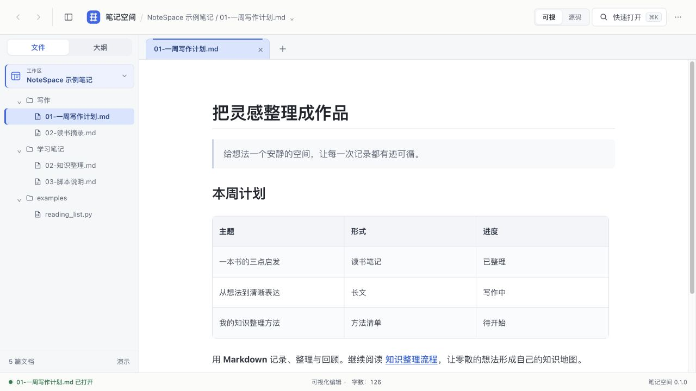
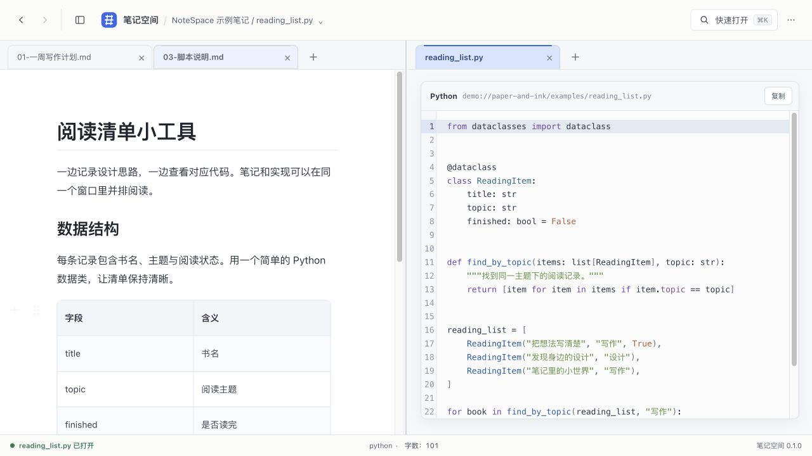

# NoteSpace（笔记空间）

一个本地优先的 Markdown 与文本桌面编辑器。专注写作、阅读与整理，支持可视化编辑、多工作区和分屏浏览。

源码仓库：[Ysclmml/notespace](https://github.com/Ysclmml/notespace)。

## 软件截图

以下截图均使用合成测试文档，在应用的浏览器演示模式中实拍。

### 可视化编辑

文件树、标签与清晰的正文排版，直接编辑标题、列表和表格。



### 分屏阅读与代码编辑

并排查看笔记和代码，支持语法高亮、独立标签与可调整的分屏宽度。



### 图表预览

Mermaid 图表可放大查看，支持缩放、平移和适应窗口。


## 核心功能

- **Markdown 编辑**：可视化编辑与源码切换，支持表格、代码块和中文输入。
- **工作区管理**：同时打开多个工作区，使用文件树、标题大纲和快速打开整理文档。
- **标签与分屏**：单击临时预览，双击或编辑固定标签；标签可在分屏之间拖动，分隔线可调整宽度。
- **文档导航**：本地 Markdown 链接跳转，前进与后退可跨标签、跨分屏恢复阅读位置。
- **代码与文本**：常见代码、配置和纯文本文件支持语法高亮、编辑与保存。
- **查找与统计**：`Cmd/Ctrl+F` 查找当前页面，实时查看当前文档字数、字符数和行数。
- **保存与外部变化**：手动保存或停止输入后自动保存；感知外部新增、修改与删除，未保存修改保留并提示处理。
- **图片与图表**：粘贴截图自动保存到文档同目录或工作区指定目录，再插入图片链接；支持图片引用编辑，以及图片和 Mermaid 的缩放预览。
- **个性化设置**：中英文界面、字号与正文宽度、隐藏文件显示，以及恢复上次浏览或空白启动。
- **网页链接**：HTTP/HTTPS 链接可在系统默认浏览器中打开。

## 技术栈

- 桌面：Tauri 2 + Rust
- 前端：React 19 + TypeScript + Vite
- 编辑器：Milkdown/ProseMirror + CodeMirror 6 + Lezer
- 工具：Node 24 + pnpm 10

## 本地开发

在 macOS 上安装 Node.js 24、pnpm 10.32.1、Rust 工具链和 Xcode Command Line Tools 后运行：

```bash
pnpm install --frozen-lockfile
pnpm desktop:dev
```

运行检查、测试与构建：

```bash
pnpm verify
```

## 构建 macOS 应用

生成可直接双击启动的 Debug 应用：

```bash
pnpm exec tauri build --debug --bundles app
open "src-tauri/target/debug/bundle/macos/NoteSpace.app"
```

应用位于 `src-tauri/target/debug/bundle/macos/NoteSpace.app`，已包含前端资源，启动时无需运行开发服务器。
