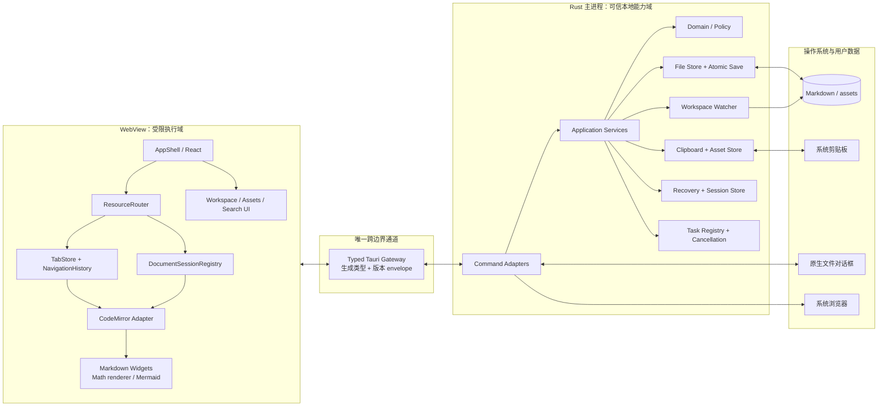

# 02. 系统架构

> **历史参考（baseline 0.1）**：当前架构以 [DESIGN.md](../DESIGN.md) 和 [ADR-0005](../decisions/0005-lean-local-editor-boundary.md) 为准。预冻结 IPC、可信宿主、复杂恢复和 Ruby 门禁已退役，不得从本文件恢复。

> 状态：`Approved design baseline 0.1`；IPC 字段级 schema 在 Phase 0 / F0 冻结  
> 适用范围：桌面端 MVP 及其后续兼容扩展  
> 技术基线：Tauri 2 + React + TypeScript + Vite + CodeMirror 6 + Rust  
> 配套契约：[03-domain-model-and-contracts.md](./03-domain-model-and-contracts.md)

## 0. 规范性约定与架构不变量

本文件是系统边界与模块职责的**事实来源**。聊天历史、代理记忆、临时代码和任务摘要不能覆盖本文件。发生上下文压缩或换代理后，实现者 **MUST** 重新阅读与任务有关的章节。本文使用 **MUST / MUST NOT** 表示强制要求，**SHOULD / SHOULD NOT** 表示默认要求，**MAY** 表示兼容的可选项。

| ID | 架构不变量 |
|---|---|
| `ARCH-INV-001` | 文件系统、剪贴板、恢复数据和原生对话框能力 **MUST** 留在 Rust 可信边界；WebView 不得取得通用文件能力。 |
| `ARCH-INV-002` | Markdown 文件与资源文件 **MUST** 是用户内容的事实来源；索引、缓存和恢复数据不得取代它们。 |
| `ARCH-INV-003` | 一个规范化文档 **MUST** 只有一个 `DocumentSession`；Tab、Pane 和历史项不得复制出可分叉正文。 |
| `ARCH-INV-004` | Tab **MUST** 是前端资源浏览会话，而不是 WebView、文件句柄或文档正文容器。 |
| `ARCH-INV-005` | 所有本地资源打开 **MUST** 经过 `ResourceRouter -> typed gateway -> Rust ResourceResolver`。 |
| `ARCH-INV-006` | 跨边界接口 **MUST** 使用有版本的白名单命令和生成类型；禁止万能读写/执行 IPC。 |
| `ARCH-INV-007` | 病态内容 **MUST** 在进入 WebView 前预检；安全阻断的正文不得跨边界。 |
| `ARCH-INV-008` | 保存 **MUST** 使用磁盘 revision 比对和同目录原子替换；外部变化不得静默覆盖。 |
| `ARCH-INV-009` | 文档渲染结果 **MUST** 是原文的可丢弃投影；widget 或 HTML 不得反向成为正文真相。 |
| `ARCH-INV-010` | feature 间 **MUST** 通过 app/domain port 协作，不得穿透目录访问对方内部 store 或 Rust infrastructure。 |

稳定 ID 不得复用为其他含义。要改变上述不变量，变更者 **MUST** 先更新本文和第 03 章，新增 ADR，再修改 schema、生成类型、实现和契约测试；不能仅在聊天中约定。

## 1. 本章解决什么问题

本项目不是“在网页里放一个 Markdown 文本框”，而是一个**可以编辑的本地文档浏览器**。它需要同时保证：

- Typora 式的单画面编辑与渲染体验；
- 本地 Markdown 文件仍是唯一可迁移、可被其他工具读取的事实来源；
- 同一个 Tab 可以原地跳转并前进/后退，也可以把目标打开到新 Tab；
- 截图粘贴直接落盘为资源文件，禁止误把大段图片 Base64 放进正文；
- 异常长行或大文件在进入 WebView 前被识别，应用不能因病态输入失去响应；
- Mermaid 等图表可以安全渲染、全屏缩放和平移；
- 后续增加分栏、反向链接、全文搜索、Git、AI 或插件时，不推翻文档、Tab 和导航模型；
- 多个实现代理能够按目录并行工作，通过冻结的领域契约和 IPC 集成。

本章规定模块和进程边界；具体字段、状态机、错误码和时序见第 03 章。

当前仓库只运行 `pnpm repo:check` 做断链、合并残留、个人路径和内嵌 Base64 的轻量检查。

## 2. 已冻结的架构决策

除非建立 ADR 并更新契约，下列决策视为实现基线：

1. **桌面容器使用 Tauri 2。** 不启动本地 HTTP 服务，不把文件访问交给 WebView。
2. **UI 使用 React + TypeScript + Vite。** React 负责应用壳和业务视图，不作为文档内容模型。
3. **编辑内核使用 CodeMirror 6。** Markdown 原文始终是编辑事实来源；渲染效果由 decoration、widget 和受控浮层提供。
4. **Rust 是本地能力边界。** 文件读取预检、路径解析、原子保存、剪贴板图片、文件监听、恢复数据和长任务取消均在 Rust 中实现。
5. **一个规范化文件只对应一个 `DocumentSession`。** 多个 Tab/历史项引用同一会话，正文和脏状态共享，选择和滚动位置独立。
6. **Tab 不等于文件，也不等于 WebView。** Tab 是前端轻量浏览会话；一个窗口通常只有一个 WebView。
7. **Markdown 文件不导入数据库。** 数据库或索引以后只能作为可重建的派生数据，不能成为正文唯一来源。
8. **IPC 是窄能力白名单。** 禁止提供 `readFile(path)`、`writeFile(path)`、`exec(command)` 之类的通用桥接接口。
9. **文档内容按不可信输入处理。** 原始 HTML、SVG、Mermaid、外链和本地路径都不能绕过净化与路径策略。
10. **大文件支持采用降级而非复杂分块编辑器。** 正常文档优先；病态超长行在 Rust 预检阶段进入安全页。

## 3. 运行时总览



### 3.1 一条完整数据链

打开文件的正常路径为：

```text
用户链接/文件树
  -> ResourceRouter 产生 ResourceRef
  -> Rust resource_resolve 规范化并检查授权范围
  -> DocumentSessionRegistry 对 DocumentId 去重
  -> Rust document_open 流式预检并读取
  -> DocumentSession 保存正文和修订信息
  -> CodeMirror view 投影当前会话
```

保存路径为：

```text
CodeMirror transaction
  -> DocumentSession 的 SessionRevision +1
  -> 保存取得不可变正文快照
  -> Rust 比对 expected DiskRevision
  -> 同目录临时文件 + flush/fsync + rename + 目录 fsync
  -> 返回新 DiskRevision
  -> 仅把该快照对应的 SessionRevision 标为已持久化
```

如果保存期间又发生编辑，保存成功后会话仍然是 dirty；禁止简单地把整个会话标记为 clean。

## 4. 进程、信任和权限边界

| 区域 | 信任级别 | 可以做 | 不可以做 |
|---|---|---|---|
| Rust 主进程 | 可信本地能力域 | 访问用户授权目录、原子保存、监听文件、读剪贴板图片、启动系统浏览器 | 执行 Markdown 中的脚本；接受未经规范化的路径直接写盘 |
| WebView 应用代码 | 受限应用域 | 编辑文本、管理 Tab/历史、调用已声明 IPC、渲染净化后的内容 | 直接访问任意文件；拼装 shell 命令；把文档 HTML 当可信内容插入 DOM |
| Markdown/HTML/Mermaid 内容 | 不可信数据 | 作为文本解析；经过安全策略后渲染 | 运行 JavaScript、事件处理器、任意 iframe、任意本地文件 URL |
| 外部 URL/远程图片 | 外部不可信资源 | 经用户策略交给系统浏览器；可选择性加载 | 自动取得本地文档内容、Tauri IPC 能力或身份信息 |
| 未来插件 | 默认不可信扩展域 | 只能取得显式声明并由用户批准的 capability | 直接导入 Rust 基础设施模块或绕过 Command API |

必须落实的安全措施：

- Tauri capability 只开放实际使用的命令、窗口和目录范围；生产构建关闭开发工具入口。
- Content Security Policy 默认禁止远程脚本、`eval`、内联事件处理器和任意 iframe。
- Markdown 中的 HTML 默认禁用；如果未来开放，必须先通过固定 allowlist 的 sanitizer。
- Mermaid 使用严格安全级别，输出 SVG 再净化；图内链接仍交给 `ResourceRouter`。
- WebView 不接收可直接访问磁盘的绝对路径 capability。UI 展示路径与实际访问句柄分离。
- 所有本地链接由 Rust 相对于来源文档解析，执行 Unicode/分隔符规范化、`..` 检查、符号链接解析和授权根校验。
- 越出工作区的链接返回 `NeedsGrant`，不能静默读取。用户授权后才产生新的路径 capability。
- 外部 HTTP(S) 链接交给系统浏览器，不能在拥有 Tauri bridge 的应用页面中直接导航。

## 5. 前端架构

### 5.1 层次和依赖方向

```text
React views / feature UI
        ↓
application controllers（router、tabs、sessions、commands）
        ↓
domain types + pure reducers + ports
        ↓
infrastructure/tauri（唯一 invoke/listen 实现）
```

领域层不得导入 React、Tauri、DOM 或 CodeMirror。feature 可以依赖领域接口，但 feature 之间不得通过对方内部 store 互调；跨 feature 行为必须走 `ResourceRouter`、命令总线或明确的 port。

### 5.2 核心模块

| 模块 | 唯一职责 | 关键约束 |
|---|---|---|
| `AppShell` | 窗口布局、菜单、快捷键分发、全局错误边界 | 不直接读写文件；不保存文档业务状态 |
| `ResourceRouter` | 把文件树、正文链接、搜索结果等统一转换为资源导航 | 所有打开行为必须带 `disposition`；禁止 `window.location` 打开本地资源 |
| `TabStore` | Tab 生命周期、当前 Tab、关闭恢复、可持久化摘要 | Tab 只引用资源和历史，不持有第二份正文 |
| `NavigationHistory` | push/replace/back/forward 和离开前捕获 `ViewState` | 普通编辑、移动光标、滚动只更新当前项，不新增历史 |
| `DocumentSessionRegistry` | 按规范化 `DocumentId` 去重、引用计数、脏状态和保存协调 | 文档正文只有一份；Tab 关闭不等于会话立即销毁 |
| `EditorAdapter` | CodeMirror transaction、selection、decoration、撤销与会话同步 | 不能直接调用 Tauri；渲染 widget 不修改 Markdown 原文 |
| `MarkdownRenderService` | 按语法树生成标题、链接、图片、公式等 widget | 只处理视口附近节点；耗时渲染必须可取消或丢弃过期结果 |
| `DiagramService` | Mermaid 解析、缓存、净化、全屏查看 | 设文本、节点和时间上限；错误只影响当前图块 |
| `AssetController` | 图片粘贴事务和 Markdown 链接插入 | 文件落盘成功后才改正文；插入失败要释放孤儿资源 |
| `WorkspaceController` | 文件树、Outline、最近工作区、监听事件协调 | 文件树不是磁盘真相，事件丢失后必须可重扫 |
| `CommandRegistry` | 菜单、快捷键和上下文动作统一命令 | UI 不把平台快捷键硬编码进领域逻辑 |

### 5.3 文档内容与视图状态

`DocumentSession` 持有当前不可变文本快照、会话修订和文档级撤销语义；`DocumentView` 持有选择、滚动、折叠和临时搜索状态。多个 Tab 打开同一文档时：

- 内容、dirty、磁盘冲突和保存状态共享；
- 选择、滚动、折叠和导航返回位置独立；
- 切换 Tab 时，从该 `NavEntry.viewState` 恢复视图；
- 后续实现分栏时，各 `DocumentView` 通过 session transaction coordinator 同步 `ChangeSet`，不能复制正文形成两个可分叉缓冲区；
- 撤销/重做属于文档会话，而不是某一个 Tab。来自另一视图的内容变化不能被当作独立磁盘版本。

MVP 可以只挂载当前可见的 CodeMirror `EditorView`，但卸载前必须保存 `ViewState`，且 `DocumentSession` 不能随视图卸载。

## 6. Rust 架构

### 6.1 分层

```text
commands（Tauri adapter、schema 校验）
    ↓
application（用例编排、锁、取消、事件）
    ↓
domain（路径/修订/策略/错误；无 Tauri、无具体文件系统）
    ↓
infrastructure（fs、watcher、clipboard、settings、recovery）
```

| 模块 | 职责 | 不能承担的职责 |
|---|---|---|
| `commands` | 解包版本 envelope、调用应用服务、把错误映射为稳定错误码 | 直接执行文件 I/O；返回任意 JSON |
| `application::workspace` | 打开/关闭/重扫工作区，管理授权根 | 渲染文件树 UI |
| `application::document` | 打开、预检、保存、重载、冲突解决 | 保存 Tab 或 CodeMirror 状态 |
| `application::asset` | 剪贴板导入、草稿资源迁移、孤儿回收 | 直接修改前端正文 |
| `application::resource` | 相对链接解析、资源分类、授权判断 | 自动访问越界路径 |
| `application::task_registry` | operation 注册、取消 token、进度和生命周期 | 在取消后伪装成功 |
| `domain` | `WorkspaceId`、locator、revision、policy、error 等纯模型 | 依赖 Tauri 或具体 OS API |
| `infrastructure::file_store` | 流式预检、UTF-8 读取、同目录原子写 | 决定 UI 如何解决冲突 |
| `infrastructure::watcher` | 监听、去抖、归并、丢失检测 | 把 watcher 顺序当作绝对可靠事务日志 |
| `infrastructure::recovery` | 恢复快照、启动保险、临时文件清理 | 替代 Markdown 文件成为事实来源 |

### 6.2 Rust/TypeScript 责任矩阵

| 问题 | Rust 最终负责 | TypeScript 最终负责 |
|---|---|---|
| 文件路径是否合法 | 是 | 只展示解析结果 |
| 当前编辑正文 | 仅在打开/保存/恢复时处理快照 | 是，`DocumentSession` 持有当前文本 |
| 磁盘修订/冲突 | 是 | 保存并解释 Rust 返回的 opaque revision |
| session revision/dirty | 否 | 是 |
| 原子保存 | 是 | 发出带 expected revision 的请求 |
| Tab 和前进后退 | 否 | 是 |
| 滚动/选择/折叠 | 否 | 是 |
| Markdown/Mermaid 渲染 | 只提供安全配置/资源解析 | 是 |
| 剪贴板图片编码与落盘 | 是 | 决定插入位置和 alt 文本 |
| 大文件预检 | 是 | 根据 outcome 显示普通、大文本或安全页面 |
| 文件监听 | 是 | 合并到会话和文件树状态 |
| 崩溃恢复快照 | 持久化和清理 | 产生 checkpoint、决定恢复交互 |

## 7. IPC：窄能力接口

### 7.1 规则

- IPC 语义、不变量和稳定 ID 以第 03 章为规范来源；Rust schema 是经契约测试约束的可执行 wire schema，并生成 `src/generated/ipc.ts` 提交仓库。文档、Rust schema、生成 TS **MUST** 同步；生成文件禁止手改。
- 每个请求带 `apiVersion`、`requestId`，可取消操作再带 `operationId`。
- 命令返回判别联合；错误使用稳定 `AppError`，不能让前端解析 Rust 错误字符串。
- 任何调用都要经过 `src/infrastructure/tauri/gateway.ts`。业务模块不能直接 `invoke` 或 `listen`。
- 每个命令对应一个用户能力，不提供通用路径 + 操作字符串的“万能命令”。
- 前进/后退、Tab 切换、CodeMirror 编辑等纯前端操作不跨 IPC。

### 7.2 v1 命令白名单（含显式 P1 预留）

| 命令 | 用途 | 明确不做什么 |
|---|---|---|
| `app_capabilities_v1` | 握手、版本和平台能力 | 不返回敏感环境变量 |
| `app_state_reconcile_v1` / `app_open_resources_ack_v1` / `app_close_respond_v1` | 查询 app-scope 未决原生请求、确认 open 批次或幂等响应关闭 | 不接受 raw path，不用丢失事件猜状态，不在 dirty 决议失败时继续关闭 |
| `workspace_pick_v1` | 通过原生对话框取得工作区授权 | 不接受 WebView 随意传入绝对路径 |
| `workspace_open_v1` / `workspace_open_recent_v1` | 建立或恢复工作区 capability | 不读取工作区外文件 |
| `workspace_close_v1` / `workspace_rescan_v1` | 释放资源、权威重扫 | 不改变文档正文 |
| `document_pick_v1` | 原生选择并授权工作区外单个 Markdown | 不接受 WebView 传入绝对路径 |
| `resource_grant_v1` | 续接此前 needsGrant 的目标或资产目录授权 | 不接受前端改写目标 |
| `resource_resolve_v1` | 相对来源文档解析链接并分类 | 不自动打开外链或越界文件 |
| `resource_preview_v1` | P1 对已解析资源做有界、可取消、只读摘要 | 不返回完整正文或创建可编辑 session/history |
| `document_create_draft_v1` | 幂等创建 Rust-owned DraftId/DocumentId 与空白 dirty 文档 | 不写用户文件或由前端生成 identity |
| `document_open_v1` | 预检并返回可编辑、安全阻断或不支持 outcome | 异常超长行不得进入 WebView |
| `document_save_v1` | compare-and-save 原子写入 | 默认不覆盖外部变化 |
| `document_prepare_save_as_v1` / `document_save_as_abort_v1` / `document_save_as_v1` / `document_save_as_status_v1` / `document_save_as_ack_v1` | 以 durable intent 选择目标、可取消 prepared、原子提交，并在前端 rebind 后确认 | 不回滚 committing/committed，不留下临时 URI，不因响应丢失删除唯一恢复资产 |
| `document_read_disk_snapshot_v1` | 冲突页读取经预检的当前磁盘版本用于比较 | 不重载或修改 dirty session |
| `document_reload_v1` | 按实际磁盘修订重载 | 前端 dirty 时不能静默调用 |
| `document_resolve_conflict_v1` | 执行用户明确选择的 reload/overwrite/recreate；另存走 Save As 两阶段命令 | 不提供盲覆盖，recreate 只接受 absent revision |
| `document_repair_v1` | 按预检 token 提取/删除异常 Base64 节点 | 不返回异常正文给 WebView |
| `asset_import_clipboard_v1` | 读取图片、编码、写 staging/asset 目录 | 不把图片编码为 Markdown Base64 |
| `asset_release_v1` | 延迟回收插入失败或已撤销的孤儿资源 | 不删除仍被正文引用的资源 |
| `session_checkpoint_v1` | 持久化单个 dirty 文档恢复稿 | 不替代显式保存，也不保存 Tab 摘要 |
| `session_discard_v1` | 用户明确“不保存”后清 active session 恢复项并安全 tombstone draft staging | 不在调用成功前关闭 dirty UI，不删除用户文件/资产 |
| `recovery_list_v1` / `recovery_open_v1` / `recovery_discard_v1` | 列举、预检打开或明确丢弃恢复稿 | 不自动覆盖用户 Markdown |
| `window_state_save_v1` / `window_state_load_v1` | P1 持久化 Tab/历史/View State 摘要 | 不包含正文或绝对路径 |
| `task_cancel_v1` | 请求取消 operation | 不保证越过提交点的保存回滚 |
| `resource_open_external_v1` / `resource_reveal_v1` | 用户手势下交系统应用，或以窄化 `RevealTarget` 在 Finder/Explorer 显示授权根/条目 | 不接受 raw path、未知 scheme 或 shell |

命令的精确请求/响应见第 03 章。未来能力必须新增明确命令和 schema；不能为了省事增加通用文件系统桥。

external-open/reveal 的用户激活由可信前端 `CommandBroker` 的不可序列化、短生命周期 receipt 约束；Rust wire 不接收 WebView 自签“gesture=true”，而独立重验 ResourceRef/RevealTarget、scheme 与 capability。目录 reveal 只能使用 workspace id + 根内相对路径或显式 workspace root，不能引入绝对路径捷径。两层测试边界以第 03 章 `CONTRACT-019` 为准。

### 7.3 后端事件白名单

Rust 只主动发送以下类别事件：

- `workspace.filesChanged`：已归并的新增、删除、修改、可能重命名；
- `workspace.capabilityChanged`：权限根撤销/恢复与 capability epoch 变化；
- `document.externalChanged`：打开文档的实际磁盘修订或读写权限发生变化；
- `task.progress`：长预检、修复、重扫、资源迁移进度；
- `task.finished`：可选的后台任务结束通知；
- `recovery.snapshotFailed`：恢复数据持久化失败；
- `app.closeRequested`：Rust hold 原生关闭并以稳定 request id 通知前端汇总未保存文档，直到明确 cancel/proceed；
- `app.openResourcesRequested`：Rust 把 Finder、文件关联或 native drop 转为 grant-backed 资源/工作区 target 后有序投递，未 ack 批次可查询重投。

所有事件带版本、scope、递增序号和 event id。事件不是事务日志：前端检测到序号缺口时调用重扫/状态查询，而不是猜测缺失内容；app scope 固定通过 `app_state_reconcile_v1` 恢复，并使用“原子 snapshot 到 S、缓存实时事件、丢弃 <=S、连续重放 >S、再 gap 则重试”的算法。native-open ack 与 close response 的边界以第 03 章为准；checkpoint 不代替 dirty-close 的用户决议。

## 8. 并发、取消和背压

### 8.1 操作级规则

- Rust 为每个可取消请求建立 `operationId -> CancellationToken`。
- 文件预检、哈希、修复、资源拷贝和重扫在固定大小块之间检查取消。
- 每个规范化文档有 keyed async mutex；保存、重载和修复按文档串行，互不相关的文件可并行。
- 前端每次 Tab 导航增加 `navigationEpoch`。旧 epoch 的结果即使返回，也只能进入共享 session cache，不能覆盖当前 Tab。
- 多个 Tab 同时打开同一文件时，`OpenCoordinator` 合并底层读取；单个调用者取消只解除自身等待，最后一个等待者离开后才取消底层任务。
- Mermaid、Outline、语法装饰等派生任务携带 `SessionRevision`；结果落地前必须验证修订仍一致。
- watcher 事件按规范化路径去抖和归并，默认窗口 100–250 ms；发现队列溢出直接标记工作区需要重扫。

### 8.2 保存的提交点

保存分三个阶段：

1. `Preparing`：校验修订、建立临时文件，可取消；
2. `Writing`：分块写入并 fsync，可取消，取消时删除临时文件；
3. `Committing`：最终复核后 rename，进入此阶段即不可取消。

如果 `task_cancel_v1` 与提交并发，最终结果可能是 `Cancelled`（未提交）或 `Saved`（已提交），不能返回含糊状态。前端必须等待原保存请求的终态，不能根据 cancel 请求的成功响应推断磁盘状态。

### 8.3 前端背压

- session checkpoint 采用 trailing debounce；同一会话未完成时只保留最新修订，不排队保存所有中间版本。
- 自动保存未来启用时也遵循“最多一个 in-flight + 一个最新待保存快照”。
- 文件树批量事件在一帧内归并后更新 store。
- Mermaid 只渲染可见或即将可见的块，并限制并发；离开视口的任务可以取消。
- 大文本模式关闭 Mermaid、图片解码、拼写和昂贵 decoration，但保留编辑、查找和显式保存。

## 9. 文件、资源和恢复策略

### 9.1 文件是真相

- 普通工作区中的 `.md` 与资源目录是用户数据。
- 应用数据目录只保存设置、最近工作区、Tab 摘要、恢复 checkpoint、临时草稿和可重建索引。
- 如果应用数据目录丢失，用户 Markdown 仍完整可读。
- 对未编辑文档不执行无意义保存；打开后立即关闭必须产生零字节差异。

### 9.2 图片粘贴事务

```text
paste event 检测到 image/*
  -> preventDefault（阻止 HTML/data URI 进入正文）
  -> asset_import_clipboard_v1
  -> Rust 写文件并返回 AssetRef + 推荐相对 URI
  -> 前端单个 CodeMirror transaction 插入 
  -> 插入失败/撤销后进入延迟 orphan 回收，而非立即破坏 redo
```

未保存文档的图片先放应用 staging。第一次 Save As 使用两阶段应用事务：Rust 先选择目标并返回受 token 保护的 URI replacement plan；前端冻结编辑、以一个 session transaction 应用 replacement，再提交已经规范化的正文；Rust 先把资源安全写到目标，再原子提交 Markdown。失败时前端反向应用 replacement，Rust 清理本次目标产物并保留 staging/恢复记录。

### 9.3 启动保险

- 每个脏会话 checkpoint 包含来源磁盘 revision、session revision、正文快照或增量、更新时间，不直接覆盖源文件。
- 应用启动时先显示壳，再询问是否恢复；不能在 UI 可交互前自动重开上次导致崩溃的文件。
- 如果上次打开某文档时进程异常退出，将该文档标记为 `suspect`；下一次只做 Rust 预检，安全后才进入编辑器。
- 同目录遗留临时保存文件只由 recovery service 按固定命名、校验来源和过期策略清理，不允许递归删除宽泛路径。

## 10. 建议仓库结构与并行所有权

当前采用单桌面应用布局，避免在 MVP 前引入 monorepo 复杂度；未来确有第二个应用时再把稳定模块提取到 `packages/`。

```text
.
├── docs/
│   ├── decisions/                 # ADR
│   ├── design/                    # 已批准设计基线与待 F0 字段契约
│   └── tasks/                     # 每个实施 Task 的持久化交接
├── scripts/
│   └── check_repository.mjs       # 轻量仓库检查
├── src/
│   ├── app/
│   │   ├── bootstrap/
│   │   ├── commands/
│   │   ├── router/                # ResourceRouter
│   │   ├── sessions/              # DocumentSessionRegistry
│   │   ├── tabs/                  # TabStore / NavigationHistory
│   │   └── shell/
│   ├── domain/                    # 手写 TS 领域模型、reducers、ports
│   ├── features/
│   │   ├── editor/                # CodeMirror adapter + live preview
│   │   ├── workspace/             # 文件树、outline、导航 UI
│   │   ├── assets/                # 粘贴和资源 UI
│   │   └── diagrams/              # Mermaid widget/viewer
│   ├── generated/
│   │   └── ipc.ts                 # Rust schema 生成，禁止手改
│   ├── infrastructure/
│   │   └── tauri/                 # 唯一 invoke/listen gateway
│   └── main.tsx
├── src-tauri/
│   ├── capabilities/
│   ├── src/
│   │   ├── commands/              # 薄 Tauri adapters
│   │   ├── application/
│   │   │   ├── asset/
│   │   │   ├── document/
│   │   │   ├── resource/
│   │   │   ├── task_registry/
│   │   │   └── workspace/
│   │   ├── domain/                # 纯 Rust value objects/policies/errors
│   │   ├── infrastructure/
│   │   │   ├── clipboard/
│   │   │   ├── file_store/
│   │   │   ├── recovery/
│   │   │   ├── settings/
│   │   │   └── watcher/
│   │   ├── ipc_schema.rs          # schema 入口和版本
│   │   ├── events.rs
│   │   └── lib.rs
│   └── Cargo.toml
└── tests/
    ├── contract/                  # Rust schema ↔ generated TS/golden
    ├── integration/               # file store、保存冲突、watcher
    ├── e2e/                       # 用户路径
    └── fixtures/                  # 真实语法缩小样本、异常长行生成器
```

并行实现时遵守：

- `src/generated/ipc.ts` 和 `src-tauri/src/ipc_schema.rs` 是共享冻结点，只由“契约负责人”修改；其他代理提交契约变更请求。
- editor、workspace、assets、diagrams 只能通过 `src/domain` 的 port 或 app 层协作。
- Rust infrastructure 可各自并行，但只能由 application service 组合，command adapter 不跨层直调。
- 测试 fixture 不能提交真实 10 MiB Base64；使用运行时生成器和小型边界样本。
- 每个模块先提供 in-memory/fake port，使依赖模块不必等待 Tauri 实现。

## 11. 可扩展点及其约束

| 后续功能 | 接入位置 | 不能破坏的约束 |
|---|---|---|
| 分栏 | 新增 `PaneStore`，每 pane 承载 Tab/DocumentView | 仍共享唯一 DocumentSession |
| 全文搜索 | Rust `SearchIndexPort` + 虚拟 `ResourceRef` | 索引可重建，不成为正文来源 |
| 反向链接/知识图谱 | Workspace 派生索引 + 虚拟资源页 | 链接解析仍走 ResourceResolver |
| Git diff | 新 virtual Resource provider 和 Rust Git capability | 不把 Git 状态混入文档 session revision |
| AI 引用/问答 | 新 feature + 用户选择的文档快照 | 默认不上传工作区；必须显示引用和授权范围 |
| 插件 | 命令/资源 provider + capability manifest | 插件不能获得内部 store 或任意 IPC |
| 同步 | 独立 SyncPort，作用于文件 revision | 不绕过冲突模型或私自覆盖磁盘 |
| 自定义渲染器 | 受限 widget provider | 不执行文档脚本，不持有文件 capability |

资源路由必须使用开放判别联合的注册表，新增页面不要求改写 Tab 模型。未知资源类型必须显示“当前版本不支持”，不能崩溃或误当文件路径。

## 12. 可观测性和故障隔离

- Rust 与前端共享 `requestId`、`operationId`、`workspaceId`、`documentId` 作为关联字段。
- 日志默认记录操作、耗时、字节数、结果码，不记录正文、剪贴板内容或完整绝对路径。
- 可将路径记录为工作区相对路径或稳定哈希；用户主动导出诊断包时再明确征得路径授权。
- Mermaid、图片解码、文件树、索引任一模块失败不得使编辑器崩溃；React feature 级 error boundary 显示局部错误。
- panic 边界只能把未知错误映射为 `Internal` 并记录本地诊断；绝不能继续写盘。
- 关键性能埋点：预检、首次可编辑、编辑 transaction、Tab 恢复、图表渲染、保存写入、fsync、watcher 延迟。

## 13. 架构验收门槛

在功能代理开始大规模集成前，至少通过以下架构测试：

1. 前端 lint/依赖测试证明 `src/domain` 不依赖 React/Tauri/CodeMirror，只有 tauri gateway 直接调用 `invoke/listen`。
2. Rust command adapter 的测试证明它只委托 application service；文件系统 fake 可以跑完整打开/保存冲突用例。
3. Rust schema 生成 TS 后 `git diff --exit-code src/generated/ipc.ts`，防止契约漂移。
4. 两个 Tab 打开同一文档只产生一个 session；编辑一处后另一处重新显示时内容一致，而滚动位置独立。
5. 旧导航请求晚于新请求返回时，不会替换当前 Tab。
6. 保存期间继续输入，第一次保存成功后 session 仍 dirty，第二次保存才 clean。
7. 外部修改与本地 dirty 同时存在时，原文、本地缓冲区都不被静默覆盖。
8. 10 MiB 单行 data URI 在 Rust 预检阶段被阻断，正文从未跨入 WebView。
9. Tauri capability 测试证明 WebView 无任意目录读取、写入或命令执行权限。
10. Mermaid 错误、超限或净化失败仅替换当前图块为错误卡片，其他编辑功能保持可用。

这些门槛不是完整产品验收，而是确认模块边界足以支撑后续并行开发。
