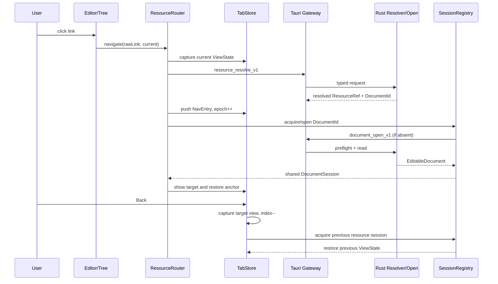
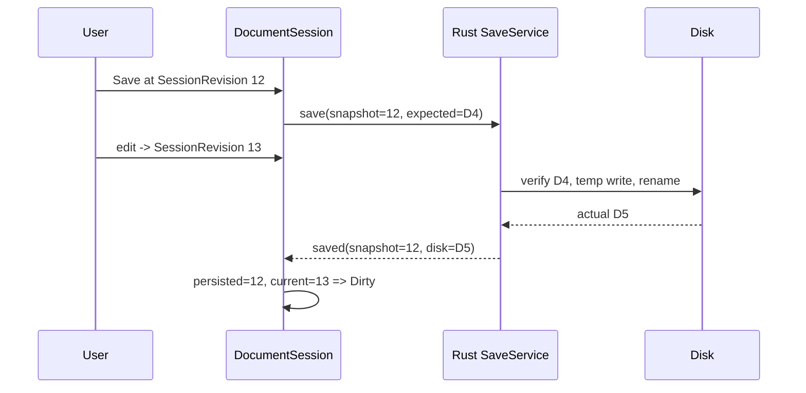
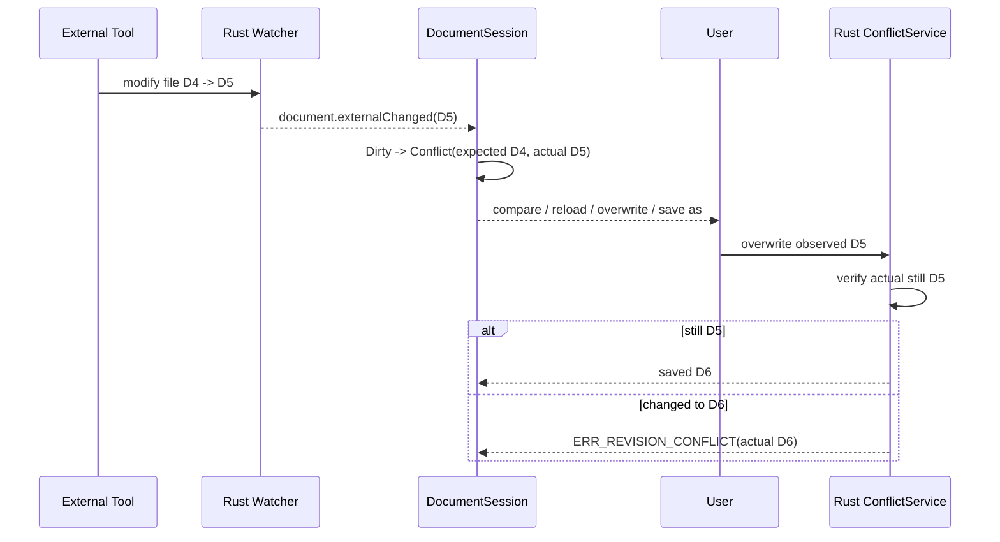
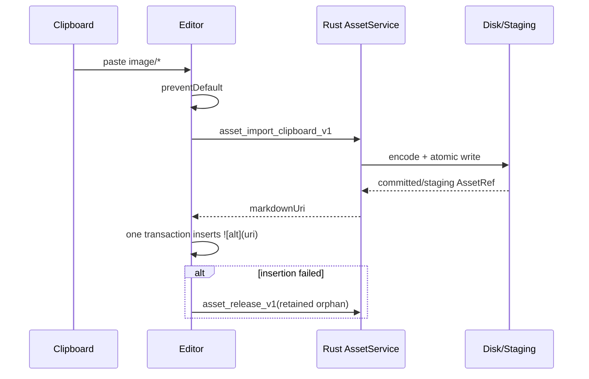
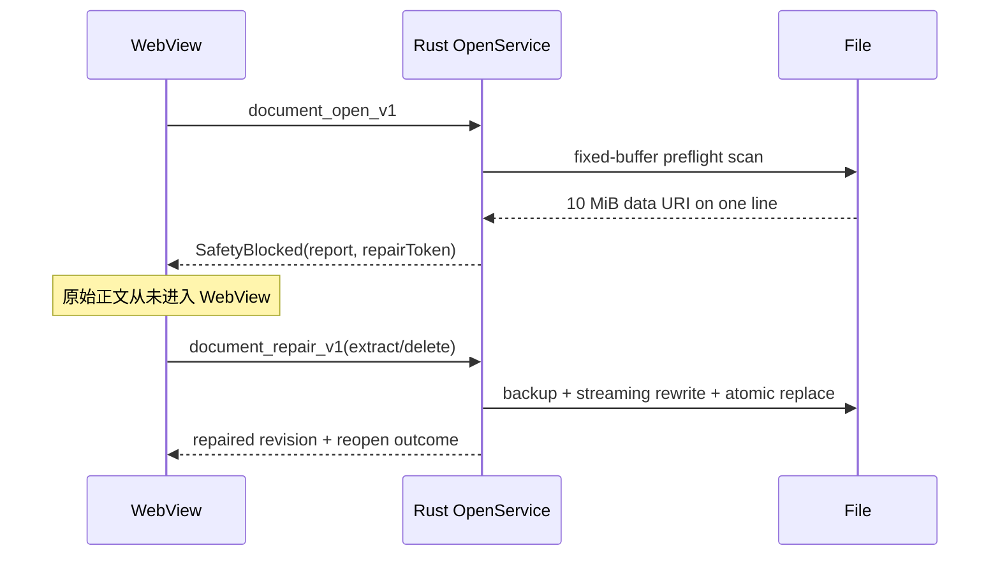

# 03. 领域模型与接口契约

> **历史参考（baseline 0.1）**：当前只为已经实现的命令定义小型 serde/TypeScript 类型，详见 [DESIGN.md](../DESIGN.md)、[ADR-0005](../decisions/0005-lean-local-editor-boundary.md) 和 [ADR-0006](../decisions/0006-visual-editor-explicit-source-mode.md)。本文件中的未来命令全集、事件 reconcile、巨型 transport 和持久化 Save-As 协议不是当前契约；任何 CodeMirror-only buffer、`editorMode="livePreview"` 或光标驱动源码显隐描述也已由 ADR-0006 取代。

> 状态：`Historical design baseline 0.1`；当前编辑模型为 baseline 0.3
> 契约版本：`1.0-draft`  
> 配套架构：[02-system-architecture.md](./02-system-architecture.md)  
> 读者：实现前端、Rust、编辑器、工作区、资源、图表和测试的所有代理

## 0. 规范性约定与变更纪律

本文件是 baseline 0.1 领域模型的历史细节来源。当前实际契约先看根 `AGENTS.md`、`PROJECT_STATE.md`、`DESIGN.md`、`REQUIREMENTS.md` 和 accepted ADR；本文件只约束其中未被 ADR-0005/0006 退役或修订的部分，不能反向恢复未来命令全集或旧编辑模型。

规范词含义：

- **MUST / MUST NOT**：实现和测试必须满足；偏离必须先修改本文件并建立 ADR；
- **SHOULD / SHOULD NOT**：默认实现，偏离时必须在 PR/变更记录解释；
- **MAY**：兼容的可选行为。

带稳定 ID 的不变量、接口、命令、事件和错误码不得被复用为其他语义。废弃项保留 ID 并标记 `Deprecated`。F0 前可通过 Integration 评审同步修订本文件；F0 后任何字段级破坏性变更 **MUST** 按第 16 节流程执行并新增 ADR。

## 1. 核心不变量

| ID            | 规范                                                                                                                                                                                                          |
| ------------- | ------------------------------------------------------------------------------------------------------------------------------------------------------------------------------------------------------------- |
| `DOM-INV-001` | 在同一应用实例中，同一规范化文件 locator **MUST** 只映射到一个 `DocumentId`。                                                                                                                                 |
| `DOM-INV-002` | 同一 `DocumentId` **MUST** 最多存在一个活动 `DocumentSession`；多个 Tab/Pane 共享它。                                                                                                                         |
| `DOM-INV-003` | `SessionRevision` 与 `DiskRevision` **MUST** 分离；任何一方不得推导或冒充另一方。                                                                                                                             |
| `DOM-INV-004` | `Tab`、`NavEntry`、`ViewState` **MUST NOT** 保存 Markdown 正文副本。                                                                                                                                          |
| `DOM-INV-005` | dirty **MUST** 由当前 session revision 与已持久化 session revision 比较得到，不能由 UI 布尔值任意设置。                                                                                                       |
| `DOM-INV-006` | 用户的 Markdown/资源文件是正文事实来源；恢复数据和索引 **MUST** 是可丢弃或可重建的派生数据。                                                                                                                  |
| `DOM-INV-007` | WebView 传入的路径字符串 **MUST NOT** 被直接用于文件访问；必须先经 `ResourceResolver` 和 capability 校验。                                                                                                    |
| `DOM-INV-008` | 本地 dirty 与外部修改并存时，系统 **MUST NOT** 静默覆盖任何一方。                                                                                                                                             |
| `DOM-INV-009` | 保存成功只持久化请求携带的 `snapshotSessionRevision`；如果之后已有新编辑，会话 **MUST** 保持 dirty。                                                                                                          |
| `DOM-INV-010` | 每次内容改变 **MUST** 单调增加 `SessionRevision`；选择、滚动、折叠改变不得增加它。                                                                                                                            |
| `DOM-INV-011` | 异常超长行或大 Base64 在 `document_open` 返回 `SafetyBlocked` 时，原始正文 **MUST NOT** 跨入 WebView。                                                                                                        |
| `DOM-INV-012` | 图片粘贴 **MUST** 写为资源文件并插入相对引用；产品路径不得生成 `data:image/...;base64` 正文。                                                                                                                 |
| `DOM-INV-013` | 后退/前进 **MUST** 恢复资源和独立 `ViewState`，不得只记文件名或裸 `scrollTop`。                                                                                                                               |
| `DOM-INV-014` | 后端事件是可丢失通知而非事务日志；检测到 sequence 缺口时前端 **MUST** 权威重扫/查询。                                                                                                                         |
| `DOM-INV-015` | 取消越过保存提交点后 **MUST NOT** 伪装成回滚；调用者必须取得唯一终态 `Saved` 或 `Cancelled`。                                                                                                                 |
| `DOM-INV-016` | 同一正文的不同视图可有独立选择/滚动，但 **MUST** 按同一 session transaction 顺序观察内容变化。                                                                                                                |
| `DOM-INV-017` | draft 首次 Save As **MUST** 原位晋升现有 `DocumentId`；Tab、历史和 session 不得因得到持久化路径而换成第二份文档身份。                                                                                         |
| `DOM-INV-018` | 已保存文档 Save As 后当前 session **MUST** 原位 rebind 到新 locator；所有当前显示该 session 的 NavEntry replace 为新 resource，不 push 历史；旧的非当前历史 locator 保留，未来重开旧文件产生新的 DocumentId。 |
| `DOM-INV-019` | Save As 的磁盘提交与前端接纳之间 **MUST** 有 durable intent/journal；未 ack 前不得销毁唯一 rollback/recovery 资产，重试或重启必须得到唯一终态。                                                               |
| `DOM-INV-020` | 原生 close 与 open-resource 请求 **MUST** 在 Rust 中保持为可查询 pending state，直到匹配 request id 的 response/ack；可丢事件本身不得成为唯一副本。                                                           |

## 2. 标识、路径与通用值对象

以下 TypeScript 是 wire 语义的规范说明。Rust schema 是本契约的可执行映射，并生成 `src/generated/ipc.ts`；三者 **MUST** 由 contract tests 保持一致。运行时代码导入生成类型，手写领域类型可以包装生成类型，但不得复制出不兼容字段。发现冲突时不得自行选择一方：先按第 16 节确认并修复契约漂移。

```ts
type Brand<T, Name extends string> = T & { readonly __brand: Name };

type WorkspaceId = Brand<string, "WorkspaceId">;
type DocumentId = Brand<string, "DocumentId">;
type DocumentSessionId = Brand<string, "DocumentSessionId">;
type DocumentViewId = Brand<string, "DocumentViewId">;
type DraftId = Brand<string, "DraftId">;
type TabId = Brand<string, "TabId">;
type PaneId = Brand<string, "PaneId">;
type NavEntryId = Brand<string, "NavEntryId">;
type AssetId = Brand<string, "AssetId">;
type GrantId = Brand<string, "GrantId">;
type GrantRequestId = Brand<string, "GrantRequestId">;
type RecoveryId = Brand<string, "RecoveryId">;
type RequestId = Brand<string, "RequestId">;
type OperationId = Brand<string, "OperationId">;
type EventId = Brand<string, "EventId">;

type RelativePath = Brand<string, "RelativePath">;
type RevisionToken = Brand<string, "RevisionToken">;
type ContentHash = Brand<string, "ContentHash">;
```

### 2.1 ID 规则

- ID **MUST** 是 opaque 字符串；前端不得从 ID 解析路径、时间或权限。
- 新 ID **SHOULD** 使用 UUIDv7 或等价的高质量唯一标识。
- `DocumentId` 是运行期文档身份；持久化恢复时以 locator 重新解析，不能假定跨安装永久不变。
- `DocumentSessionId` 在会话被完全回收后失效；旧异步结果必须同时校验 session id 和 revision。
- `SessionRevision` 是从 0 开始的 JS safe integer，达到 `Number.MAX_SAFE_INTEGER` 前 **MUST** 通过关闭并重新建立 session 换代，禁止回绕。

### 2.2 相对路径规则

- wire 上的 `RelativePath` **MUST** 使用 `/` 分隔，禁止 NUL、空段和未解析的 `.` / `..`。
- 大小写和 Unicode 的文件身份比较由 Rust 根据实际文件系统策略处理；前端不得用简单字符串小写化判断同一文件。
- `relativePath` 用于展示和稳定引用；Rust 内部还要维护不跨 IPC 的 canonical key（规范化绝对路径、文件标识和授权根）。
- 符号链接目标 **MUST** 在 capability 检查后才可访问。解析后越出授权根时返回 `NeedsGrant`。

## 3. Workspace 模型

```ts
interface Workspace {
  id: WorkspaceId;
  displayName: string;
  displayPath: string; // 仅展示；不是文件 capability
  state: WorkspaceState;
  caseSensitivity: "sensitive" | "insensitive" | "unknown";
  scanGeneration: number;
  capabilityEpoch: number;
  openedAt: string; // ISO-8601
}

type WorkspaceState =
  | { kind: "opening" }
  | { kind: "ready" }
  | { kind: "rescanning"; operationId: OperationId }
  | { kind: "degraded"; reason: AppError }
  | { kind: "closing" }
  | { kind: "closed" };
```

`capabilityEpoch` 在权限根被撤销、替换或重新授权时递增。携带旧 epoch 的路径解析缓存 **MUST** 失效。

工作区状态转换：

```text
Closed -> Opening -> Ready <-> Rescanning
                    Ready -> Degraded -> Rescanning -> Ready
                    Ready/Degraded -> Closing -> Closed
Opening --error--> Closed
```

规范：

- `WS-INV-001`：`WorkspaceId` **MUST** 对应一个由 Rust 持有的授权根；前端只有 opaque id。
- `WS-INV-002`：文件树是 `scanGeneration` 下的快照；watcher overflow 后 **MUST** 进入 `degraded` 并重扫。
- `WS-INV-003`：关闭工作区前，前端 **MUST** 处理或 checkpoint 所有引用该工作区的 dirty session。
- `WS-INV-004`：工作区关闭后，旧 `ResourceRef` MAY 保留在历史中，但再次打开时 **MUST** 重新解析授权。

## 4. ResourceRef、DocumentLocator 与解析结果

### 4.1 可导航资源

```ts
type DocumentLocator =
  | {
      kind: "workspacePath";
      workspaceId: WorkspaceId;
      relativePath: RelativePath;
    }
  | {
      kind: "draft";
      draftId: DraftId;
      suggestedName?: string;
    }
  | {
      kind: "grantedFile";
      grantId: GrantId;
      displayName: string;
    };

type DocumentAnchor =
  | { kind: "heading"; slug: string }
  | { kind: "block"; blockId: string }
  | { kind: "sourcePosition"; line: number; column?: number };

type ResourceScope =
  | { kind: "workspace"; workspaceId: WorkspaceId }
  | { kind: "document"; documentId: DocumentId }
  | { kind: "draft"; draftId: DraftId };

type AssetOwner =
  { kind: "document"; documentId: DocumentId } | { kind: "draft"; draftId: DraftId };

type ResourceRef =
  | {
      kind: "markdown";
      locator: DocumentLocator;
      anchor?: DocumentAnchor;
    }
  | {
      kind: "asset";
      scope: ResourceScope;
      relativePath: RelativePath;
      mediaType?: string;
    }
  | {
      kind: "externalUrl";
      url: string;
    }
  | {
      kind: "virtual";
      providerId: string;
      resourceId: string;
      params?: Record<string, string>;
    };

type RevealTarget =
  | { kind: "workspaceRoot"; workspaceId: WorkspaceId }
  | { kind: "workspaceEntry"; workspaceId: WorkspaceId; relativePath: RelativePath }
  | { kind: "grantedFile"; grantId: GrantId }
  | { kind: "asset"; scope: ResourceScope; relativePath: RelativePath };
```

Tab 只认识 `ResourceRef`，不针对“文件 Tab”“搜索 Tab”建立互斥的数据模型。新增全文搜索、Git diff、设置、AI 引用页时注册新的 virtual provider 即可。

`RevealTarget` 只服务于系统文件管理器 reveal，不是可导航资源，也不进入 Tab/历史。`workspaceRoot` 明确表示授权根；`workspaceEntry` 只携带根内相对路径；`grantedFile` 复用 Rust-owned grant；`asset` 复用受控 scope。它没有 raw/absolute path variant。

### 4.2 文档内原始链接

正文解析器不得自行拼绝对路径。它把以下结构交给 Rust：

```ts
interface UnresolvedLink {
  sourceDocumentId: DocumentId;
  rawDestination: string;
  linkKindHint?: "markdown" | "asset" | "url" | "unknown";
}

type ResourceResolution =
  | { kind: "resolved"; resource: ResourceRef; documentId?: DocumentId }
  | {
      kind: "needsGrant";
      grantRequestId: GrantRequestId;
      displayTarget: string;
      reason: "outsideWorkspace" | "revokedGrant" | "assetDirectory";
    }
  | { kind: "missing"; candidate?: ResourceRef; displayTarget: string }
  | { kind: "unsupported"; scheme?: string; displayTarget: string }
  | { kind: "invalid"; error: AppError };

interface ResourcePreviewRequest {
  resource: ResourceRef;
  maxUtf8Bytes: number;
  maxLines: number;
}

type ResourcePreviewOutcome =
  | {
      kind: "text";
      resource: ResourceRef;
      title: string;
      excerpt: string;
      truncated: boolean;
      resolvedAnchor?: DocumentAnchor;
      diskRevision?: ExpectedDiskRevision;
    }
  | { kind: "safetyBlocked"; resource: ResourceRef; report: SafetyBlockedReport }
  | { kind: "unsupported"; resource: ResourceRef; report: UnsupportedReport };
```

规范：

- `RES-INV-001`：本地链接 **MUST** 相对于来源文档所在目录解析，而不是工作区根或进程 cwd。
- `RES-INV-002`：`#fragment` **MUST** 解析为同一 document locator 上的 anchor。
- `RES-INV-003`：`http`/`https`/`mailto` **MUST** 产生 `externalUrl`；仅在用户明确点击/命令后交给系统默认应用。
- `RES-INV-004`：未知 scheme **MUST** 返回 `unsupported`；禁止隐式交给 shell。
- `RES-INV-005`：`ResourceRef` 的 display 字段不能作为文件访问参数。
- `RES-INV-006`：preview 必须先执行与资源类型相符的授权和预检，再只返回服务端上限内的摘要；不得用完整 `document_open_v1` 正文模拟 Peek。
- `RES-INV-007`：reveal 必须从 `RevealTarget` 重新校验有效 workspace/grant/scope、规范化相对路径并确认目标仍在授权根内；draft asset、失效 scope、越界或不存在目标必须拒绝，禁止退回前端 raw path。

## 5. 修订模型

### 5.1 SessionRevision

```ts
type SessionRevision = Brand<number, "SessionRevision">;
```

每个改变正文的 session transaction 把 revision 增加 1。一次 transaction 无论包含多少 changes 都只增加一次。加载磁盘内容建立 session 时从 0 开始；外部重载替换正文也增加一次，并同时设置新的 persisted revision。

### 5.2 DiskRevision

```ts
interface DiskRevision {
  token: RevisionToken; // compare-and-save 使用的 opaque token
  sizeBytes: number;
  modifiedAtUnixMs: number;
  contentHash: ContentHash; // "blake3:<hex>"
  fileIdentityHint?: string; // 仅诊断/重命名匹配，不得用于授权
}

type ExpectedDiskRevision =
  { kind: "present"; revision: DiskRevision } | { kind: "absent" };
```

- token 由 Rust 产生，至少绑定规范化文件身份、内容哈希及足够的元数据。
- `contentHash` **MUST** 对打开/重载/保存后的实际字节流计算；不能对 JS UTF-16 表示计算。
- 前端只回传 token，不得构造或修改 `DiskRevision`。
- 文件元数据变化但内容哈希相同时，Rust MAY 产生新 token；前端可无内容重载地接纳新 revision。
- `ExpectedDiskRevision.absent` 只允许创建新目标；目标已存在时返回 revision conflict。

### 5.3 文本格式

```ts
interface DocumentFormat {
  encoding: "utf8";
  hasUtf8Bom: boolean;
  lineEnding: "lf" | "crlf" | "mixed" | "none";
  preferredLineEnding: "lf" | "crlf";
}
```

P0 只编辑 UTF-8。无损打开/关闭不得写盘。源码模式 CodeMirror **SHOULD** 使用 `preferredLineEnding` 插入新行。未发生正文 transaction 时已有混合换行不得被规范化；首次可视正文编辑后 Milkdown/ProseMirror serializer 可以规范化整篇等价 Markdown，且必须更新 session 的格式元数据。

## 6. DocumentSession

### 6.1 结构

下列是前端内存领域对象，不直接作为完整 IPC payload：

```ts
interface DocumentSession {
  id: DocumentSessionId;
  descriptor: DocumentDescriptor;
  currentSessionRevision: SessionRevision;
  persistedSessionRevision: SessionRevision;
  diskRevision: ExpectedDiskRevision;
  format: DocumentFormat;
  mode: "normal" | "sourceOnly";
  persistence: PersistenceState;
  lifecycle: "active" | "closing";
  refCount: number;
  lastAccessedAt: number;
}

interface DocumentDescriptor {
  documentId: DocumentId;
  locator: DocumentLocator;
  displayName: string;
  workspaceId?: WorkspaceId;
  relativePath?: RelativePath;
  readOnly: boolean;
}
```

`DocumentSession` 只在 `DocumentOpenOutcome.editable`（或可编辑恢复结果）之后建立，因此其 descriptor、format、mode、disk revision 和受控文本 buffer 始终完整。加载页、安全页、Unsupported 页和打开失败页属于当前 Tab 的 `DocumentLoadState`，不伪装成半初始化 session：

```ts
type DocumentLoadState =
  | { kind: "loading"; resource: ResourceRef; operationId: OperationId }
  | {
      kind: "safetyBlocked";
      resource: ResourceRef;
      descriptor: DocumentDescriptor;
      report: SafetyBlockedReport;
      repairToken: string;
      diskRevision: ExpectedDiskRevision;
    }
  | {
      kind: "unsupported";
      resource: ResourceRef;
      descriptor?: DocumentDescriptor;
      report: UnsupportedReport;
    }
  | { kind: "failed"; resource: ResourceRef; error: AppError };
```

当前 Markdown 文本是 session 的受控、可保存 buffer，不重复出现在持久化 Tab JSON 中。可视模式使用 Milkdown/ProseMirror 作为交互模型，并在每个正文 transaction 后同步序列化到该 buffer；源码模式可使用 CodeMirror `Text`。ProseMirror JSON 和 CodeMirror `Text` 都不是持久化格式；`DocumentLoadState` 也不得携带被阻断正文。

### 6.2 阶段与持久化子状态

```ts
type DiscardReturnState =
  | { kind: "dirty" }
  | {
      kind: "conflict";
      expected: ExpectedDiskRevision;
      actual: ExpectedDiskRevision;
      reason: "modified" | "deleted" | "replaced" | "created";
    }
  | { kind: "missing"; lastKnown: DiskRevision | null }
  | { kind: "saveError"; error: AppError }
  | { kind: "reloadError"; error: AppError; observed?: ExpectedDiskRevision };

type PersistenceState =
  | { kind: "clean" }
  | { kind: "dirty" }
  | {
      kind: "reloading";
      operationId: OperationId;
      previousDiskRevision: ExpectedDiskRevision;
    }
  | {
      kind: "saving";
      operationId: OperationId;
      snapshotSessionRevision: SessionRevision;
      expectedDiskRevision: ExpectedDiskRevision;
      editOccurredAfterSnapshot: boolean;
    }
  | {
      kind: "conflict";
      expected: ExpectedDiskRevision;
      actual: ExpectedDiskRevision;
      reason: "modified" | "deleted" | "replaced" | "created";
    }
  | { kind: "missing"; lastKnown: DiskRevision | null }
  | { kind: "saveError"; error: AppError }
  | { kind: "reloadError"; error: AppError; observed?: ExpectedDiskRevision }
  | {
      kind: "discarding";
      operationId: OperationId;
      discardIntentId: string;
      snapshotSessionRevision: SessionRevision;
      previous: DiscardReturnState;
    };
```

派生 dirty：

```ts
const dirty = currentSessionRevision !== persistedSessionRevision;
```

`PersistenceState.kind` 表达工作流，不能替代上式。比如 `saving` 可以同时 dirty；保存 snapshot 成功而期间又输入时，回到 `dirty`。

### 6.3 状态转换

```text
NoSession -> ResourceLoading -> Session/Clean
                             -> Session/Dirty       (恢复稿或新文档)
                             -> SafetyPage | UnsupportedPage | ErrorPage

Session/Clean --edit--> Session/Dirty
Session/Dirty --save--> Session/Saving
Session/Clean --explicit save--> Session/Saving
Session/Saving --saved, no newer edit--> Session/Clean
Session/Saving --saved, newer edit--> Session/Dirty
Session/Saving --revision mismatch--> Session/Conflict
Session/Saving --I/O error--> Session/SaveError
Session/SaveError --retry--> Session/Saving
Session/SaveError --edit--> Session/Dirty
Session/SaveError --save as--> Session/Saving
Session/SaveError --close--> Closing

Session/Clean --external modify--> Session/Reloading
Session/Reloading --editable--> Session/Clean
Session/Reloading --edit--> Session/Dirty (取消/使 reload token stale)
Session/Reloading --safety/unsupported--> retire clean session -> SafetyPage|UnsupportedPage
Session/Reloading --I/O error--> Session/ReloadError
Session/ReloadError --retry--> Session/Reloading
Session/ReloadError --edit--> Session/Dirty
Session/ReloadError --close--> Closing
Session/Dirty --external modify/delete--> Session/Conflict
Session/Clean --external delete--> Session/Missing
Session/Missing --save as--> Session/Saving
Session/Missing --confirmed recreate(absent)--> Session/Saving
Session/Missing --edit--> Session/Dirty (下一次原路径保存仍须显式 recreate)
Session/Missing --close--> Closing

Session/Conflict --reload/discard local, editable--> Session/Clean
Session/Conflict --reload result safety/unsupported/error--> Session/Conflict (保留本地 dirty buffer)
Session/Conflict --confirmed overwrite/recreate--> Session/Saving -> Session/Clean|Dirty
Session/Conflict --save as--> Session/Saving -> Session/Clean|Dirty

Session/Dirty|Conflict|Missing|SaveError|ReloadError --confirmed don't save--> Session/Discarding
Session/Discarding --success--> Closing -> retired
Session/Discarding --failure--> previous state (buffer/checkpoint 可恢复)
Session/Discarding --new edit--> rejected while frozen
Close confirmation --cancel--> exact previous state (不调用 IPC)
```

规范：

- `DOC-INV-001`：`DocumentSessionRegistry` **MUST** 按 Rust 返回的 `DocumentId` 去重，而不是按用户输入字符串去重。
- `DOC-INV-002`：session 从 registry 回收前 **MUST** 满足 `refCount == 0`、非 dirty、无 in-flight 操作且无恢复保留要求。
- `DOC-INV-003`：`safetyBlocked` 只存在于无正文的 `DocumentLoadState`/IPC outcome；不得建立 `DocumentSession` 或保存被阻断正文。
- `DOC-INV-004`：自动外部重载只允许 clean session；dirty session 必须进入 conflict。
- `DOC-INV-005`：外部重载替换正文后，文档级 undo 历史 **MUST** 建立新边界，禁止 undo 回被替换的未知磁盘版本。
- `DOC-INV-006`：保存失败不能改变 `persistedSessionRevision` 或丢弃当前 buffer。
- `DOC-INV-007`：`OpenMode` **MUST** 只表示 normal/sourceOnly 性能等级；可写性 **MUST** 只由 `DocumentDescriptor.readOnly` 和当前 capability 决定。

### 6.4 Session transaction coordinator

所有正文变化（键盘输入、格式命令、图片链接插入、跨视图同步、撤销/重做、首次 Save As 的资源 URI 规范化）**MUST** 经过同一个 session transaction coordinator：

```ts
interface SessionEditIntent {
  sessionId: DocumentSessionId;
  originViewId: DocumentViewId;
  baseRevision: SessionRevision;
  // 内部承载 ProseMirror 或 CodeMirror 正文 transaction 的已序列化 Markdown 变更；不得跨 IPC
  changes: unknown;
  addToHistory: boolean;
}

type SessionEditResult =
  | { kind: "applied"; newRevision: SessionRevision }
  | { kind: "stale"; actualRevision: SessionRevision }
  | { kind: "rejected"; error: AppError };
```

- `DOC-INV-008`：coordinator **MUST** 单线程排序 edit intent；`baseRevision` 过期时不得直接应用到错误位置。
- `DOC-INV-009`：被拒绝/过期的 view **MUST** 从 session 当前文本重新同步；不能建立第二份正文分支。
- `DOC-INV-010`：内容变化广播到其他 view 时不得重复加入文档级 undo 历史。
- `DOC-INV-011`：撤销/重做是 session 级命令；发起它的 Tab 只决定恢复哪个 selection/view state。
- `DOC-INV-012`：Reloading 期间一旦发生本地 edit，reload 结果不得替换 buffer；取消/作废旧 token，迟到结果若证明磁盘与 dirty 本地版本并存则进入 Conflict，否则丢弃并重新核对。
- `DOC-INV-013`：session 的 document identity 与 locator 只以 `descriptor.documentId/locator` 为准；不得再维护可分叉的平行字段。
- `DOC-INV-014`：进入 Discarding 前必须冻结 edit/save/checkpoint/migration；Rust 根据 descriptor locator 推导实际 draft/持久化 scope，并拒绝请求 scope 与 locator 不匹配，不能信任前端枚举决定删除范围。
- `DOC-INV-015`：ProseMirror 正文 transaction **MUST** 在同一同步链路中更新 session buffer 与保存读取的 latest-text ref；权威正文 **MUST NOT** 通过 200 ms debounce 延迟，输入后立即保存必须包含最后一次输入。

MVP 只有一个可见 EditorView 时仍须保留 coordinator port；后续分栏不得绕过它。活动 session **SHOULD** 保留有限 `ChangeDesc` 以映射其他 Tab 的 selection/scroll source offset；超出窗口时使用第 7 节块锚点重新定位。

## 7. Tab、NavEntry 与 ViewState

### 7.1 数据模型

```ts
interface Tab {
  id: TabId;
  title: string;
  history: NavigationHistory;
  pinned: boolean;
  lifecycle: "open" | "closing" | "closed";
  navigationEpoch: number;
}

interface NavigationHistory {
  entries: NavEntry[];
  index: number; // -1 表示尚无资源
}

interface NavEntry {
  id: NavEntryId;
  resource: ResourceRef;
  titleSnapshot?: string;
  viewState?: ViewState;
  visitedAt: number;
}

interface DocumentView {
  id: DocumentViewId;
  sessionId: DocumentSessionId;
  tabId: TabId;
  paneId?: PaneId;
  viewState: ViewState;
  mountState: "mounted" | "suspended" | "disposed";
}

interface ViewState {
  selection?: { anchor: number; head: number };
  scroll: ScrollAnchor;
  foldedRanges?: Array<{ from: number; to: number; fingerprint?: string }>;
  editorMode: "visual" | "source";
}

interface ScrollAnchor {
  topBlock?: BlockLocator;
  yWithinBlock: number;
  fallbackScrollTop: number;
}

interface BlockLocator {
  syntaxKind?: string;
  headingPath?: string[];
  sourceOffset: number;
  sourceLine: number;
  fingerprint?: string;
}
```

`DocumentView` 是运行期视图对象：它绑定一个已有 editable session，但不拥有正文、dirty、undo 或导航历史。活动视图持续更新自己的 `viewState`；离开资源、卸载 EditorView 或写入窗口状态前，才把快照复制到当前 `NavEntry.viewState`。同一 session 可有多个 `DocumentView`，每个 view 的 `editorMode`、selection、scroll 与 folds 独立。新 `normal` view 默认 `visual`；`sourceOnly` view 固定 `source`，模式切换不产生正文 transaction 或导航 entry。

`fingerprint` **SHOULD** 是规范化块前缀的小哈希，不得包含整块正文。恢复顺序：

1. 匹配 heading path + fingerprint；
2. 匹配临近 source offset/line 的 syntax block；
3. 使用 `sourceOffset`；
4. 最后才用 `fallbackScrollTop`。

图片/Mermaid 异步改变高度后，视图 **SHOULD** 在首轮可视节点 settled 时执行一次锚点校正；光标移动不得通过可视/源码 DOM 替换改变块高。

### 7.2 导航动作

```ts
type OpenDisposition = "current" | "newForegroundTab" | "newBackgroundTab" | "splitRight"; // 接口预留；MVP 可返回 Unsupported

type NavigationSource =
  | "link"
  | "fileTree"
  | "outline"
  | "search"
  | "backlink"
  | "command"
  | "nativeOpen"
  | "dragDrop"
  | "restore";

interface NavigateIntent {
  target: ResourceRef | UnresolvedLink;
  disposition: OpenDisposition;
  source: NavigationSource;
  originTabId?: TabId;
  originViewId?: DocumentViewId;
}

interface PreviewIntent {
  target: ResourceRef | UnresolvedLink;
  source: NavigationSource;
  originTabId: TabId;
  originViewId?: DocumentViewId;
}
```

`PreviewIntent` 是 P1 Peek 的独立读取意图，不包含 `OpenDisposition`。它可解析有界的只读摘要，但 **MUST NOT** 创建 `NavEntry`、改变历史或创建可编辑 `DocumentSession`；不支持的 provider 返回类型化 `ERR_UNSUPPORTED`。

算法：

- 当前打开：离开前 capture 当前 view；删除 index 之后的 forward entries；push 新 entry；index 指向末尾。
- 后退：先 capture 当前 entry；index - 1；解析并展示目标；不创建 entry。
- 前进：同理 index + 1。
- 同文档不同 anchor 的显式跳转 **MUST** 进入历史；程序性滚动不得进入历史。
- 自动标题更新只修改 `titleSnapshot`；不得 replace resource。
- P1 恢复已关闭 Tab **MUST** 恢复完整 history/index，而不是只恢复当前文件；持久化来源是 `WindowStateSnapshotV1.recentlyClosedTabs`。
- 历史默认上限 **SHOULD** 为 100 项；淘汰时优先从最老非当前项开始，并保持 index 正确。

规范：

- `NAV-INV-001`：普通滚动、选择、输入只更新当前 `viewState`，不得 push 历史。
- `NAV-INV-002`：异步导航结果落地前 **MUST** 校验 `tabId + navigationEpoch`。
- `NAV-INV-003`：新后台 Tab 不得改变当前 active tab。
- `NAV-INV-004`：关闭 Tab 不得自动关闭仍被其他 Tab、恢复项或 in-flight 操作引用的 session。
- `NAV-INV-005`：加载目标失败时原 history entry 保留并显示错误页，使用户仍可后退；不得偷偷回滚 index 制造与浏览器不同的行为。

## 8. AssetRef 与资源生命周期

```ts
interface AssetRef {
  id: AssetId;
  owner: AssetOwner;
  state: AssetState;
  mediaType: string;
  sizeBytes: number;
  contentHash: ContentHash;
  width?: number;
  height?: number;
  relativePath?: RelativePath;
  markdownUri: string;
}

type AssetState =
  | { kind: "staging" }
  | { kind: "committing"; operationId: OperationId }
  | { kind: "committed" }
  | { kind: "orphaned"; retainUntilUnixMs: number }
  | { kind: "deleted" }
  | { kind: "failed"; error: AppError };
```

状态转换：

```text
clipboard -> Staging -> Committing -> Committed
              |       \                      |
              |        -> Failed              |
              -> Orphaned <-------------------+（链接撤销且无其他引用）
                   |   \
                   |    -> Committed（Redo/扫描发现有效引用，rescue）
                   -> Deleted（保留期后再次验证无引用）
```

规范：

- `AST-INV-001`：资源写入成功后前端才可插入 Markdown 引用。
- `AST-INV-002`：撤销引用时不得立刻删除图片；必须保留一段 redo/崩溃恢复窗口并重新扫描引用。
- `AST-INV-003`：同内容去重 MAY 使用 content hash，但不能让删除一个文档的资源破坏另一个引用。
- `AST-INV-004`：`markdownUri` 必须由 Rust 根据目标文档位置计算，前端不得手拼 OS 路径。
- `AST-INV-005`：草稿首次保存的资源迁移和 URI 替换失败时，原 staging 文件及恢复引用必须继续有效。
- `AST-INV-006`：工作区文档与单文件 grant 文档以 document owner 创建资产，草稿以 draft owner 创建 staging；Rust 根据 locator 映射 workspace/document/draft ResourceScope。若单文件授权不包含相邻 assets 目录，必须返回 needsGrant(assetDirectory)，不得退回绝对路径或 Base64。
- `AST-INV-007`：orphaned 资产在 Redo 或引用扫描发现有效引用时必须原子 rescue 为 committed 并取消 GC；failed 只能由重试产生新终态或显式 release，不能假装 committed。

## 9. 打开预检与安全模型

```ts
interface PreflightReport {
  sizeBytes: number;
  maxLineBytes: number;
  lineCountEstimate?: number;
  hasUtf8Bom: boolean;
  detectedDataImageCount: number;
  largestDataImageEstimateBytes?: number;
}

type SafetyBlockedReport = PreflightReport & {
  kind: "safetyBlocked";
  reasons: Array<"lineTooLong" | "largeDataImage">;
  allowedActions: Array<
    "extractDataImages" | "deleteDataImages" | "openExternal" | "cancel"
  >;
};

type UnsupportedReport = PreflightReport & {
  kind: "unsupported";
  reasons: Array<"binary" | "fileTooLarge" | "invalidUtf8" | "unsupportedEncoding">;
  allowedActions: Array<"openExternal" | "cancel">;
};

type SafetyReport = SafetyBlockedReport | UnsupportedReport;

type OpenMode = "normal" | "sourceOnly";
```

`OpenMode` 只表示性能/渲染等级，是否可写由 `DocumentDescriptor.readOnly` 单独表示。两者禁止混成第三种模式：例如无写权限的 100 KiB 文件仍是 `editable/normal + readOnly=true`，表示正文可安全进入 EditorView 供阅读/选择，但所有修改与原路径保存命令被禁用。

默认阈值是实现配置而非文件格式标准；MVP 按下列顺序判定，先命中的规则获胜：

| 条件                                          | outcome                |
| --------------------------------------------- | ---------------------- |
| 明显二进制或无法无损支持的编码                | `Unsupported`          |
| 单行 `> 1 MiB` 或 data image 估算 `> 512 KiB` | `SafetyBlocked`        |
| 文件 `<= 8 MiB` 且单行 `<= 256 KiB`           | `Editable(normal)`     |
| 其余普通 UTF-8 多行文本                       | `Editable(sourceOnly)` |

阈值 **MAY** 根据基准调整，但行为不变量不变：任何 `SafetyBlocked` 内容不得进入 WebView；任何 `sourceOnly` 必须使用 CodeMirror 并关闭可视编辑、图表、图片预解码和拼写检查。普通 UTF-8 多行文本不因总字节数单独进入 Unsupported。

报告必须与 outcome 同 kind。只有 `SafetyBlockedReport` 可签发 repair token；`extractDataImages/deleteDataImages` 只有在对应 data-image 原因与扫描位置存在时才可列入 allowedActions。`UnsupportedReport`（包括 binary）永远只有外部打开/取消，不得被 UI 或命令提升为内置修复。

## 10. IPC 契约

### 10.1 Envelope

稳定接口 ID：`IPC-ENV-001`。

```ts
const IPC_API_VERSION = "1.0" as const;

interface CommandRequest<T> {
  apiVersion: typeof IPC_API_VERSION;
  requestId: RequestId;
  operationId?: OperationId;
  payload: T;
}

type CommandResponse<T> =
  | {
      apiVersion: typeof IPC_API_VERSION;
      requestId: RequestId;
      ok: true;
      payload: T;
    }
  | {
      apiVersion: typeof IPC_API_VERSION;
      requestId: RequestId;
      ok: false;
      error: AppError;
    };
```

每个 Tauri command 返回 `CommandResponse<T>`。schema 反序列化失败也必须尽可能带回 request id；完全无法识别时使用新生成的 correlation id。

### 10.2 应用与工作区命令

| ID            | 命令                        | 请求 payload                                                  | 成功 payload                                                                                          |
| ------------- | --------------------------- | ------------------------------------------------------------- | ----------------------------------------------------------------------------------------------------- |
| `IPC-CMD-001` | `app_capabilities_v1`       | `{}`                                                          | `AppCapabilities`                                                                                     |
| `IPC-CMD-002` | `app_state_reconcile_v1`    | `{}`                                                          | `AppReconcileOutcome`                                                                                 |
| `IPC-CMD-003` | `app_open_resources_ack_v1` | `{ nativeRequestId: string }`                                 | `{ kind: "acknowledged" \| "alreadyAcknowledged" \| "unknown" }`                                      |
| `IPC-CMD-004` | `app_close_respond_v1`      | `{ closeRequestId: string; decision: "cancel" \| "proceed" }` | `{ kind: "cancelled" \| "closing" \| "alreadyResolved" \| "unknown" }`                                |
| `IPC-CMD-010` | `workspace_pick_v1`         | `{ initialWorkspaceId?: WorkspaceId }`                        | `{ kind: "selected"; grantToken: string; displayPath: string } \| { kind: "cancelled" }`              |
| `IPC-CMD-011` | `workspace_open_v1`         | `{ grantToken: string }`                                      | `{ workspace: Workspace }`                                                                            |
| `IPC-CMD-012` | `workspace_open_recent_v1`  | `{ workspaceId: WorkspaceId }`                                | `{ workspace: Workspace }`                                                                            |
| `IPC-CMD-013` | `workspace_close_v1`        | `{ workspaceId: WorkspaceId; capabilityEpoch: number }`       | `{ closed: true }`                                                                                    |
| `IPC-CMD-014` | `workspace_rescan_v1`       | `WorkspaceRescanRequest`                                      | `WorkspaceSnapshotPage`                                                                               |
| `IPC-CMD-015` | `document_pick_v1`          | `{ initialWorkspaceId?: WorkspaceId }`                        | `{ kind: "selected"; resource: Extract<ResourceRef, { kind: "markdown" }> } \| { kind: "cancelled" }` |
| `IPC-CMD-016` | `resource_grant_v1`         | `{ grantRequestId: GrantRequestId }`                          | `ResourceGrantOutcome`                                                                                |

```ts
interface AppCapabilities {
  apiVersion: "1.0";
  platform: "macos" | "windows" | "linux";
  features: {
    clipboardImage: boolean;
    splitView: boolean;
    recovery: boolean;
    mermaid: boolean;
  };
  limits: {
    policyVersion: 1;
    normalFileBytes: number;
    maxEditableFileBytes: number;
    maxNormalLineBytes: number;
    safetyBlockLineBytes: number;
    safetyBlockDataImageDecodedBytes: number;
    mermaidSourceBytes: number;
    mermaidMaxNodes: number;
    mermaidRenderTimeoutMs: number;
    imageDecodedPixelMax: number;
    previewMaxUtf8Bytes: number;
    previewMaxLines: number;
    nativeOpenQueueMaxTargets: number;
    workspaceScanPageMaxEntries: number;
    ipcDefaultPayloadBytes: number;
    ipcDocumentRawContentBytes: number;
    ipcDocumentWireBytes: number;
  };
}

interface AppCloseRequest {
  closeRequestId: string;
  deadlineUnixMs?: number;
}

interface AppReconcileOutcome {
  appSequence: number;
  pendingCloseRequest?: AppCloseRequest;
  pendingOpenRequests: NativeOpenResourcesRequested[];
  pendingSaveAsIntents: PendingSaveAsSummary[];
}

type WorkspaceRescanRequest =
  | {
      kind: "start";
      workspaceId: WorkspaceId;
      knownGeneration: number;
      requestedPageEntries?: number;
    }
  | {
      kind: "next";
      workspaceId: WorkspaceId;
      scanId: string;
      cursor: string;
    };

interface WorkspaceSnapshotPage {
  workspace: Workspace;
  scanId: string;
  targetGeneration: number;
  entries: Array<{
    kind: "directory" | "markdown" | "asset" | "other";
    relativePath: RelativePath;
    displayName: string;
    sizeBytes?: number;
    modifiedAtUnixMs?: number;
  }>;
  nextCursor?: string;
  complete: boolean;
}

type ResourceGrantOutcome =
  | {
      kind: "resourceResolved";
      grantRequestId: GrantRequestId;
      resolution: Exclude<ResourceResolution, { kind: "needsGrant" }>;
    }
  | {
      kind: "assetDirectoryGranted";
      grantRequestId: GrantRequestId;
      owner: AssetOwner;
      pasteIntentId: string;
    }
  | { kind: "cancelled"; grantRequestId: GrantRequestId };
```

`grantToken` 和 `grantRequestId` 单次、短期有效且只由 Rust 原生授权流程产生。`workspace_open_v1` **MUST NOT** 接受任意绝对 path 替代 grant token。`document_pick_v1` 为工作区外单文件建立 grantedFile locator；`resource_grant_v1` 只能续接 Rust 此前建立并绑定上下文的 `needsGrant`，不能接受前端提供的目标路径。普通链接授权成功返回 `resourceResolved`；资产目录授权成功只返回与原 owner、`pasteIntentId` 绑定的 `assetDirectoryGranted` receipt，随后前端以同一 `pasteIntentId` 重试导入。

`workspace_rescan_v1` 首次 `start` 建立一个有界、可取消的 authoritative scan；Rust 把 requested page size 夹到 `workspaceScanPageMaxEntries`，且每页还必须满足默认 IPC response 字节上限。后续只接受同 workspace 的 opaque `scanId+cursor`。前端把所有 page 暂存到该 scanId，只有 `complete=true` 且页序/target generation 连续时才一次性替换文件树；取消、token 过期、sequence gap 或任一页失败都丢弃 staging 并从 start 重试，绝不把半份目录当权威快照。

`app_state_reconcile_v1` 在 capabilities 握手后和任何 app-scope sequence gap 时调用；它返回当前 app sequence、唯一未决 close request 和所有未 ack 的 native-open/Save-As intent。Rust 必须在同一 app-event lock/serialization point 下生成 pending snapshot 与 `appSequence=S`，使 snapshot 已包含所有 `sequence <= S` 的 app 状态。前端在发起 reconcile **之前** 开始缓存 app-scope 实时事件；收到 snapshot 后先原子安装它，按 eventId 去重并丢弃缓存中 `sequence <= S` 的事件，再严格按序重放连续的 `> S` 事件，最后才恢复直通消费。安装/重放期间新到事件继续进入同一缓存；若首项不是 `S+1` 或重放中再次跳号，丢弃未安装的增量并重新 reconcile，禁止部分合并。open ack/close response 只能在相应 snapshot 已安装后发送。

Rust 在原生 close 事件上先 prevent/hold，使用稳定 `closeRequestId` 重投。无 dirty session 时可以直接 `proceed`；存在 dirty session 时，前端只有在用户逐项选择后，每项都已成功保存为 clean 或经明确“不保存”完成 `session_discard_v1`，才能发送 `proceed`，用户取消则发送 `cancel`。checkpoint 是强制退出/崩溃前的保护证据，不是用户保存或丢弃决议，单独 checkpoint 成功绝不能授权 `proceed`。`app_close_respond_v1` 按 request id 幂等，过期/伪造 id 不得关闭窗口。

Rust 按 `nativeRequestId` 持有并重投 native-open 批次，直到 `app_open_resources_ack_v1`。Application Core 按 `(nativeRequestId, targetIndex)` 去重，处理完整批次（成功或类型化局部失败）后才 ack；事件丢失、监听器晚注册或 ack 响应丢失都只会重投，不会重复创建 Tab/Workspace。队列受 `nativeOpenQueueMaxTargets` 限制，溢出必须产生本地可见诊断，禁止静默丢弃。

### 10.3 资源解析命令

| ID            | 命令                  | 请求 payload             | 成功 payload             |
| ------------- | --------------------- | ------------------------ | ------------------------ |
| `IPC-CMD-020` | `resource_resolve_v1` | `UnresolvedLink`         | `ResourceResolution`     |
| `IPC-CMD-021` | `resource_preview_v1` | `ResourcePreviewRequest` | `ResourcePreviewOutcome` |

对于文件树项，Rust MAY 直接返回已解析 `ResourceRef + DocumentId`；正文链接必须走本命令或同语义的批量版本。未来增加批量命令时，其单项结果必须与本命令完全一致。`resource_preview_v1` 是 P1 Peek 的有界只读入口：服务端必须把 `maxUtf8Bytes/maxLines` 再夹到 capability 上限，先授权和预检，可取消，不创建 `DocumentSession`/`DocumentView`/`NavEntry`；virtual provider 通过第 08 章同语义的 provider preview port 实现。

### 10.4 文档命令

| ID            | 命令                             | 请求 payload                                                                                                         | 成功 payload                                                     |
| ------------- | -------------------------------- | -------------------------------------------------------------------------------------------------------------------- | ---------------------------------------------------------------- |
| `IPC-CMD-028` | `document_save_as_abort_v1`      | `{ documentId: DocumentId; saveAsIntentId: string; reason: "userCancelled" \| "superseded" \| "recoveryAbandoned" }` | `{ kind: "aborted" \| "alreadyAborted" \| "unknown" }`           |
| `IPC-CMD-029` | `document_create_draft_v1`       | `DocumentCreateDraftRequest`                                                                                         | `DocumentCreateDraftOutcome`                                     |
| `IPC-CMD-030` | `document_open_v1`               | `DocumentOpenRequest`                                                                                                | `DocumentOpenOutcome`                                            |
| `IPC-CMD-031` | `document_save_v1`               | `DocumentSaveRequest`                                                                                                | `DocumentSaveOutcome`                                            |
| `IPC-CMD-032` | `document_reload_v1`             | `{ documentId: DocumentId; knownDiskRevision: ExpectedDiskRevision }`                                                | `DocumentOpenOutcome`                                            |
| `IPC-CMD-033` | `document_resolve_conflict_v1`   | `ConflictResolutionRequest`                                                                                          | `ConflictResolutionOutcome`                                      |
| `IPC-CMD-034` | `document_repair_v1`             | `DocumentRepairRequest`                                                                                              | `DocumentRepairOutcome`                                          |
| `IPC-CMD-035` | `document_prepare_save_as_v1`    | `DocumentPrepareSaveAsRequest`                                                                                       | `DocumentPrepareSaveAsOutcome`                                   |
| `IPC-CMD-036` | `document_save_as_v1`            | `DocumentSaveAsRequest`                                                                                              | `DocumentSaveAsOutcome`                                          |
| `IPC-CMD-037` | `document_read_disk_snapshot_v1` | `{ documentId: DocumentId; observedDiskRevision: ExpectedDiskRevision }`                                             | `DocumentCompareOutcome`                                         |
| `IPC-CMD-038` | `document_save_as_status_v1`     | `{ documentId: DocumentId; saveAsIntentId: string }`                                                                 | `DocumentSaveAsStatusOutcome`                                    |
| `IPC-CMD-039` | `document_save_as_ack_v1`        | `{ documentId: DocumentId; saveAsIntentId: string; acceptedDiskRevision: DiskRevision }`                             | `{ kind: "acknowledged" \| "alreadyAcknowledged" \| "unknown" }` |

```ts
interface DocumentCreateDraftRequest {
  draftIntentId: string;
  suggestedName?: string;
}

interface DocumentCreateDraftOutcome {
  document: EditableDocument;
  initialRevisions: {
    current: SessionRevision;
    persisted: SessionRevision;
  };
}

interface DocumentOpenRequest {
  resource: Extract<ResourceRef, { kind: "markdown" }>;
  expectedDocumentId?: DocumentId;
}

type DocumentOpenOutcome =
  | { kind: "editable"; document: EditableDocument }
  | {
      kind: "safetyBlocked";
      descriptor: DocumentDescriptor;
      report: SafetyBlockedReport;
      repairToken: string;
      diskRevision: ExpectedDiskRevision;
    }
  | { kind: "unsupported"; descriptor?: DocumentDescriptor; report: UnsupportedReport };

interface EditableDocument {
  descriptor: DocumentDescriptor;
  content: string;
  mode: OpenMode;
  format: DocumentFormat;
  diskRevision: ExpectedDiskRevision;
  preflight: PreflightReport;
}

interface DocumentSaveRequest {
  documentId: DocumentId;
  content: string;
  format: DocumentFormat;
  snapshotSessionRevision: SessionRevision;
  expectedDiskRevision: ExpectedDiskRevision;
  reason: "explicit" | "autosave" | "close" | "checkpointPromotion";
}

type DocumentSaveOutcome =
  | {
      kind: "saved";
      documentId: DocumentId;
      savedSessionRevision: SessionRevision;
      newDiskRevision: DiskRevision;
      writeId: string;
      bytesWritten: number;
    }
  | {
      kind: "noop";
      documentId: DocumentId;
      savedSessionRevision: SessionRevision;
      diskRevision: ExpectedDiskRevision;
    };

type ConflictResolutionRequest =
  | {
      action: "reload";
      documentId: DocumentId;
      observedDiskRevision: ExpectedDiskRevision;
    }
  | {
      action: "overwrite";
      documentId: DocumentId;
      content: string;
      format: DocumentFormat;
      snapshotSessionRevision: SessionRevision;
      observedDiskRevision: ExpectedDiskRevision;
    }
  | {
      action: "recreate";
      documentId: DocumentId;
      content: string;
      format: DocumentFormat;
      snapshotSessionRevision: SessionRevision;
      observedDiskRevision: { kind: "absent" };
    };

type ConflictResolutionOutcome =
  | { kind: "reloadChecked"; outcome: DocumentOpenOutcome }
  | { kind: "saved"; result: DocumentSaveOutcome };

interface DocumentPrepareSaveAsRequest {
  saveAsIntentId: string;
  documentId: DocumentId;
  sourceSnapshotSessionRevision: SessionRevision;
  target:
    { kind: "prompt"; suggestedName?: string } | { kind: "grant"; grantToken: string };
  referencedDraftAssetIds: AssetId[];
}

type DocumentPrepareSaveAsOutcome =
  | { kind: "cancelled"; saveAsIntentId: string }
  | { kind: "sameDocument"; saveAsIntentId: string; documentId: DocumentId }
  | { kind: "targetAlreadyOpen"; saveAsIntentId: string; target: DocumentDescriptor }
  | {
      kind: "prepared";
      saveAsIntentId: string;
      saveAsToken: string;
      newDescriptor: DocumentDescriptor;
      targetExpectedDiskRevision: ExpectedDiskRevision;
      uriReplacements: Array<{ assetId: AssetId; oldUri: string; newUri: string }>;
      relativeLinkImpact: "none" | "baseDirectoryChanged";
    };

interface DocumentSaveAsRequest {
  saveAsIntentId: string;
  documentId: DocumentId;
  saveAsToken: string;
  content: string; // 已应用 plan 中 URI replacement
  format: DocumentFormat;
  sourceSnapshotSessionRevision: SessionRevision;
  snapshotSessionRevision: SessionRevision;
}

interface DocumentSaveAsOutcome {
  kind: "saved";
  saveAsIntentId: string;
  result: DocumentSaveOutcome;
  newDescriptor: DocumentDescriptor; // documentId 与晋升前相同
}

type DocumentSaveAsStatusOutcome =
  | { kind: "unknown"; saveAsIntentId: string }
  | { kind: "prepared"; saveAsIntentId: string; documentId: DocumentId }
  | { kind: "committing"; saveAsIntentId: string; documentId: DocumentId }
  | { kind: "committed"; outcome: DocumentSaveAsOutcome }
  | { kind: "rolledBack"; saveAsIntentId: string; documentId: DocumentId; error?: AppError }
  | { kind: "acknowledged"; saveAsIntentId: string; documentId: DocumentId };

interface PendingSaveAsSummary {
  documentId: DocumentId;
  saveAsIntentId: string;
  phase: "prepared" | "committing" | "committed" | "rolledBack";
}

type DocumentCompareOutcome =
  | {
      kind: "snapshot";
      content: string;
      format: DocumentFormat;
      diskRevision: ExpectedDiskRevision;
    }
  | {
      kind: "safetyBlocked";
      report: SafetyBlockedReport;
      diskRevision: ExpectedDiskRevision;
    }
  | {
      kind: "unsupported";
      report: UnsupportedReport;
      diskRevision: ExpectedDiskRevision;
    };

interface DocumentRepairRequest {
  repairToken: string;
  expectedDiskRevision: ExpectedDiskRevision;
  action:
    | { kind: "extractDataImages"; assetDirectoryName: string }
    | { kind: "deleteDataImages" };
}

interface DocumentRepairOutcome {
  backupDisplayPath: string;
  repairedDiskRevision: DiskRevision;
  extractedAssets: AssetRef[];
  reopen: DocumentOpenOutcome;
}
```

契约规则：

- `document_create_draft_v1` 由 Rust 同时生成 `DraftId` 与 `DocumentId`，返回 draft locator、空 UTF-8 正文、`mode=normal`、`diskRevision=absent`、`readOnly=false`。创建本身计为 session revision 1，persisted revision 为 0，因此空白未命名文档也是 dirty；普通 save 禁止，首次持久化必须走 Save As。
- `draftIntentId` 在当前应用生命周期内幂等：同一 intent 的 IPC 重试返回同一 DraftId/DocumentId 与初始 outcome，禁止生成第二个草稿；显式丢弃并释放该 draft 后才能忘记记录，调用者的新建动作必须使用新 intent。
- `content` P0 使用 UTF-8 解码后的 JS string，硬上限为能力握手返回的 `maxEditableFileBytes`；不得偷偷截断。
- `document_save_v1` 默认是 compare-and-save。revision 不符返回 `ERR_REVISION_CONFLICT`，不进入写入阶段。
- `overwrite` 不是盲覆盖：`observedDiskRevision` 必须仍等于实际 revision；再次变化时再次冲突。
- `recreate` 只允许 Missing/deleted 流程，`observedDiskRevision` 固定为 `absent`；目标已经重新出现时返回 revision conflict，不得覆盖新文件。
- draft locator **MUST** 使用 `document_save_as_v1`；对 draft 调用普通 save 返回 `ERR_INVALID_STATE`。
- `saveAsIntentId` 由 Application Core 为一次用户 Save As 意图生成，并在 prepare/save/status/ack 全流程保持不变。`document_prepare_save_as_v1` 按 `(documentId, saveAsIntentId)` 幂等：重复相同输入返回同一 terminal outcome 或同一 target/plan（可刷新绑定同 intent 的短期 token），不得再次弹 picker 或改选目标；同 intent 携带不同 source revision/asset set 时返回 `ERR_INVALID_REQUEST`。prepare 在返回前建立 app-local crash-safe journal，记录 document/source revision、目标 canonical identity/revision、URI plan、authoritative asset ledger 与阶段；大正文只以受控临时内容句柄保存，不嵌进元数据 JSON。prepare 只选择/验证目标并签发短期单次 token，不写用户 Markdown。token 绑定 intent、document id、`sourceSnapshotSessionRevision`、目标、authoritative draft owner/asset ledger 和 capability epoch。`referencedDraftAssetIds` 必须去重且每项都属于该 draft 的 staging ledger；foreign/未知/重复项返回 typed validation error。若目标相对基目录变化，返回 `relativeLinkImpact="baseDirectoryChanged"`，UI 必须统一警告普通相对链接可能改变解析结果并允许取消；P0 不声称已逐条分析普通链接。
- prepare 发现目标 canonical locator 等于当前 locator 时返回 `sameDocument`，UI 回到普通 Save；若 registry 已由另一个活动 `DocumentId`/session 占用目标，返回 `targetAlreadyOpen`，只允许切换到该文档或关闭/处理其 session 后重试。P0 禁止自动合并、替换或同时 rebind 两个 session。
- 收到 prepared 后，前端 **MUST** 冻结正文编辑，以一个 `addToHistory=false` 且可反向的 session transaction 应用全部 URI replacement，再用所得 revision/content 调用 `document_save_as_v1`。该 normalization 不能被普通 Undo 单独还原为失效的 staging URI。
- Rust **MUST** 在 commit 前扫描最终 content：拒绝任何 app staging URI（不限于本 plan），要求每个 planned new URI 至少被引用，并核对两个 snapshot revision、intent 与 token。漏报资产会残留 staging URI，多报资产会缺少 planned new URI，两者都以 `ERR_ASSET_MIGRATION_FAILED` 失败。通过后把最终正文写入 journal-owned 临时内容、持久化 `committing`，再先安全提交目标资产并按 `SAVE-ALG-001` 原子保存 Markdown；提交点后原子记录 `committed + DocumentSaveAsOutcome`，在前端 ack 前不得不可逆删除原 staging/recovery alias。
- Save As 失败时 Rust **MUST** 清理本次创建的目标资源并保留 staging；前端 **MUST** 以不进入 undo 的反向 transaction 恢复旧 URI，再解除冻结。
- `document_save_as_v1` 按 `(documentId, saveAsIntentId)` 幂等：同 intent 在 committed 后重试必须返回相同 outcome，不能消费旧 token 后报未知。响应丢失时前端调用 `document_save_as_status_v1`；应用重启时 `app_state_reconcile_v1` 列出未 ack intent。Rust 对 crash 时的 `committing` journal 必须根据 commit marker、target revision 和资产 manifest 确定性完成为 committed 或完整回滚，禁止猜测成功。
- 用户在 prepare 后的相对链接警告、保存对话或恢复中心选择取消时，前端必须调用 `document_save_as_abort_v1`。它按 intent 幂等且只允许 `prepared -> rolledBack`：撤销短期 token、清本 intent 临时目标/内容句柄并保留原文、draft staging 和 recovery；`committing/committed` 必须返回 `ERR_INVALID_STATE` 并要求 status/reconcile，绝不能伪装回滚已提交文件。picker cancelled、sameDocument、targetAlreadyOpen 由 prepare 在返回终态前自行关闭 journal；无 session 的 prepared intent 可在有界保留期后按同一 abort 语义回收，但必须先出现在 app reconcile 中且不得删除用户数据。
- 前端只有在接纳 committed outcome、完成 registry/descriptor/NavEntry rebind，并写入必要恢复状态后才调用 `document_save_as_ack_v1`。ack 的 disk revision 必须匹配 journal outcome；成功后 Rust 才可清旧 recovery alias、源 staging 和 journal 正文句柄，并保留有界 intent tombstone 使 ack/retry 幂等。unknown/rolledBack 不允许前端自行假定保存成功。
- draft Save As 成功后沿用原 `DocumentId` 并把引用 draft locator 的历史项迁移为新 locator。
- 已保存文档 Save As 成功后也沿用当前 session 的 `DocumentId`，registry 从旧 canonical locator rebind 到新 locator；所有当前显示该 session 的 NavEntry 以 replace 更新 resource 且不 push 历史，旧的非当前历史项仍指向旧文件。以后导航到旧文件时重新分配 DocumentId。
- `document_reload_v1` 和 conflict 的 `reloadChecked` 都只做 revision 校验、预检与读取，不先修改前端 session。仅 editable outcome 可建立替换正文的新 undo 边界；若 dirty/conflict session 得到 safetyBlocked、unsupported 或错误，必须保留本地 buffer 和 conflict。clean 自动重载遇到安全/不支持 outcome 时，可在安全页准备完成后回收旧 clean session。
- response 的 saved snapshot 已包含 URI normalization，按普通保存规则接纳。
- document_read_disk_snapshot_v1 只为 conflict compare 返回经过预检的当前磁盘快照，**MUST NOT** 修改 DocumentSession、dirty、undo 或 history；SafetyBlocked/Unsupported 不得携带正文。
- repair token 绑定 document、disk revision、扫描报告和有效期；不得用于其他文件。
- repair **MUST** 先建立恢复副本，再流式生成新 Markdown 和资源；成功前不得替换原文件。

### 10.5 Asset、恢复与取消命令

| ID            | 命令                        | 请求 payload                                                                                            | 成功 payload                                               |
| ------------- | --------------------------- | ------------------------------------------------------------------------------------------------------- | ---------------------------------------------------------- |
| `IPC-CMD-040` | `asset_import_clipboard_v1` | `AssetImportClipboardRequest`                                                                           | `AssetImportClipboardOutcome`                              |
| `IPC-CMD-041` | `asset_release_v1`          | `{ assetId: AssetId; reason: "insertFailed" \| "undo" \| "documentClosed"; retainUntilUnixMs: number }` | `{ state: AssetState }`                                    |
| `IPC-CMD-050` | `session_checkpoint_v1`     | `SessionCheckpointRequest`                                                                              | `{ checkpointed: SessionRevision; storedAt: string }`      |
| `IPC-CMD-051` | `recovery_list_v1`          | `{}`                                                                                                    | `{ items: RecoveryDescriptor[]; safeMode: boolean }`       |
| `IPC-CMD-052` | `recovery_open_v1`          | `{ recoveryId: RecoveryId }`                                                                            | `RecoveryOpenOutcome`                                      |
| `IPC-CMD-053` | `recovery_discard_v1`       | `{ recoveryId: RecoveryId }`                                                                            | `{ discarded: true }`                                      |
| `IPC-CMD-054` | `window_state_save_v1`      | `{ snapshot: WindowStateSnapshotV1 }`                                                                   | `{ storedAt: string }`                                     |
| `IPC-CMD-055` | `window_state_load_v1`      | `{}`                                                                                                    | `{ snapshot?: WindowStateSnapshotV1; safeMode: boolean }`  |
| `IPC-CMD-056` | `session_discard_v1`        | `SessionDiscardRequest`                                                                                 | `SessionDiscardOutcome`                                    |
| `IPC-CMD-060` | `task_cancel_v1`            | `{ operationId: OperationId }`                                                                          | `{ kind: "requested" \| "notFound" \| "pastCommitPoint" }` |
| `IPC-CMD-070` | `resource_open_external_v1` | `{ resource: ResourceRef }`                                                                             | `{ opened: true }`                                         |
| `IPC-CMD-071` | `resource_reveal_v1`        | `{ target: RevealTarget }`                                                                              | `{ revealed: true }`                                       |

```ts
interface AssetImportClipboardRequest {
  pasteIntentId: string;
  owner: AssetOwner;
  preferredFormat: "png" | "preserve";
  namingHint?: string;
}

type AssetImportClipboardOutcome =
  | { kind: "imported"; asset: AssetRef }
  | {
      kind: "needsGrant";
      grantRequestId: GrantRequestId;
      owner: AssetOwner;
      pasteIntentId: string;
      displayTarget: string;
      reason: "assetDirectory";
    };

interface SessionCheckpointRequest {
  documentId: DocumentId;
  sessionRevision: SessionRevision;
  persistedSessionRevision: SessionRevision;
  baseDiskRevision: ExpectedDiskRevision;
  content: string;
  reason: "debounce" | "appClose" | "crashGuard" | "saveAsPrepare";
  pendingSaveAsIntentId?: string;
}

interface SessionDiscardRequest {
  discardIntentId: string;
  documentId: DocumentId;
  snapshotSessionRevision: SessionRevision;
}

interface SessionDiscardOutcome {
  kind: "discarded";
  documentId: DocumentId;
  discardedRecoveryIds: RecoveryId[];
  orphanedAssetIds: AssetId[];
  draftIdentityReleased: boolean;
}

interface RecoveryDescriptor {
  id: RecoveryId;
  titleSnapshot: string;
  locatorHint?: DocumentLocator;
  sessionRevision: SessionRevision;
  persistedSessionRevision: SessionRevision;
  baseDiskRevision: ExpectedDiskRevision;
  capturedAt: string;
  quarantined: boolean;
  pendingSaveAsIntentId?: string;
}

interface RecoveredEditableDocument {
  descriptor: DocumentDescriptor;
  content: string;
  mode: OpenMode;
  format: DocumentFormat;
  observedDiskRevision: ExpectedDiskRevision;
  preflight: PreflightReport;
}

type RecoveryOpenOutcome =
  | {
      kind: "editable";
      recovery: RecoveryDescriptor;
      document: RecoveredEditableDocument;
      restoredRevisions: {
        current: SessionRevision;
        persisted: SessionRevision;
      };
      initialPersistence:
        | { kind: "clean" }
        | { kind: "dirty" }
        | {
            kind: "conflict";
            expected: ExpectedDiskRevision;
            actual: ExpectedDiskRevision;
            reason: "modified" | "deleted" | "replaced" | "created";
          };
      reconciledSaveAs?: {
        saveAsIntentId: string;
        outcome: DocumentSaveAsOutcome;
        requiresAck: true;
      };
    }
  | {
      kind: "safetyBlocked";
      descriptor: RecoveryDescriptor;
      report: SafetyBlockedReport;
    };

interface WindowStateSnapshotV1 {
  schemaVersion: 1;
  tabs: Array<{
    id: TabId;
    history: NavigationHistory;
    pinned: boolean;
  }>;
  recentlyClosedTabs: Array<{
    history: NavigationHistory;
    pinned: boolean;
    closedAt: number;
  }>;
  sidebar: { visible: boolean; width: number };
  layout:
    | {
        kind: "single";
        pane: PaneSnapshot;
        focusedPaneId: PaneId;
      }
    | {
        kind: "split";
        left: PaneSnapshot;
        right: PaneSnapshot;
        ratio: number;
        focusedPaneId: PaneId;
      };
}

interface PaneSnapshot {
  paneId: PaneId;
  tabIds: TabId[];
  activeTabId?: TabId;
}
```

checkpoint 是恢复数据，不改变 persisted session revision，也不触发 `clean`。

`session_discard_v1` 只在用户明确选择“不保存”后调用。Application Core 必须先冻结该 session、确认 `snapshotSessionRevision` 仍是当前值并停止 checkpoint/asset migration；调用失败则解除冻结并保持 dirty/session 可见，绝不能先关闭 UI。Rust 不接受前端提供删除 scope，而从 authoritative descriptor locator 推导：持久化文档仅移除该 active document 的应用恢复记录并把本次未提交、应用创建且无磁盘引用的资产转 orphan；draft 还要把该 DraftId 的 recovery/staging 根原子重命名为 app-local tombstone、从恢复索引移除并释放 draft identity，再异步清理。操作以 `discardIntentId` 幂等；两种路径都不得修改用户 Markdown 或删除用户原有资产。取消关闭不调用本命令。

同一 owner 下重复提交相同 `pasteIntentId` 时，`asset_import_clipboard_v1` **MUST** 在有界幂等窗口内返回同一 `AssetRef` 或同一终态错误，禁止因 IPC 重试生成重复资产。`needsGrant` 是非终态：`resource_grant_v1` 成功返回匹配的 `assetDirectoryGranted` 后，以同一 owner/`pasteIntentId` 重试可转为唯一 imported 终态；授权取消或换 owner 不得产生资产。

`recovery_open_v1` **MUST** 先按 `pendingSaveAsIntentId`/document id reconcile durable Save As journal，再对将返回的 checkpoint 或 journal final-content handle 执行与普通打开等价的安全预检；safetyBlocked outcome 不得携带正文。`committing` 必须先确定性完成或回滚；`prepared/rolledBack` 返回原 dirty recovery；`committed` 返回新 descriptor 与已提交 final snapshot，若实际 disk revision 仍等于 outcome 则 `initialPersistence=clean`，否则返回该 final snapshot 且 `initialPersistence=conflict`，并携带 `reconciledSaveAs.requiresAck`。前端完成 session/rebind 后 ack，不能先恢复旧 draft/staging URI。

普通 editable recovery 返回完整 `RecoveredEditableDocument` 与原 current/persisted revisions，前端把 `observedDiskRevision` 写入新 session 的磁盘基线并按 `initialPersistence` 建立 dirty/conflict，绝不能把恢复内容当成与该磁盘 revision 对应的已保存正文。若 locator 仍获授权，Rust 同时读取当前实际 disk revision：它与 `baseDiskRevision` 不同则 `initialPersistence=conflict`，普通 Save 被拒绝；相同则为 dirty。若 locator 已失效/无授权，Rust 生成新的 draft descriptor、`observedDiskRevision=absent`，恢复稿只能 Save As。打开恢复稿不写用户文件。`recovery_discard_v1` 只删除明确 recoveryId 对应的应用恢复项；有关联未 ack Save As 时必须先按 journal phase 处理，不能删除 committed target、用户 Markdown 或仍用于 rollback 的资产。

`window_state_save_v1` 与 `window_state_load_v1` 属于 P1 完整会话恢复；snapshot 不得包含正文、文件绝对路径或恢复内容。P0 dirty 恢复只依赖 `session_checkpoint_v1`、`recovery_list_v1`、`recovery_open_v1`、`recovery_discard_v1` 与显式关闭时的 `session_discard_v1`，不能被 `session.restore` feature flag 关闭。

window snapshot 中每个 open TabId 必须恰好出现在一个 `PaneSnapshot.tabIds`，pane 的 activeTabId 必须属于自身列表，focusedPaneId 必须等于存在的 paneId；不满足时丢弃布局摘要但保留 recovery。single/split 迁移和 ratio clamp 由独立 schema migration 测试覆盖，禁止用全局 activeTab 推测两个 pane 的活动 Tab。

`resource_open_external_v1` 只接受已解析 ResourceRef：externalUrl 仅允许 http/https/mailto，本地资源重新校验 capability 后交系统应用。`resource_reveal_v1` 只接受 `RevealTarget`；workspace root/entry 必须重新校验 workspace capability 与根内相对路径，standalone 文件重新校验 grant，asset 重新校验非 draft scope/ledger。两者都禁止接受 raw path、未知 scheme 或 shell 命令。

“用户手势”不是 Rust wire 可真实性验证的字段，禁止设计由同一 WebView 自签的伪安全 token。可信前端 `CommandBroker` 在真实 pointer/keyboard/native-menu handler 中生成不可序列化、同一 event-loop task 有效的 `UserActivationReceipt`；external-open/reveal port 必须消费该 receipt 后才允许 gateway 发送上面两个窄命令，普通 feature 不能直接取得 gateway。Rust 的责任是再次校验 ResourceRef/RevealTarget、capability 与 scheme，CSP/renderer 净化保证文档内容不能执行任意 JS。测试分别证明 CommandBroker 拒绝 programmatic invocation，以及 Rust 即使收到调用仍拒绝 raw/越权/危险目标；不得声称 Rust 能从 wire payload 推断浏览器手势。

普通命令遵守 `ipcDefaultPayloadBytes`；任何携带完整 Markdown `content` 的方向使用独立双重预算：解码后 UTF-8 正文字节不超过 `ipcDocumentRawContentBytes`，序列化 wire 总字节不超过 `ipcDocumentWireBytes`。该专用预算仅适用于 `document_open_v1`、`document_reload_v1`、`document_save_v1`、`document_resolve_conflict_v1`、`document_save_as_v1`、`document_read_disk_snapshot_v1`、`document_repair_v1` 的 reopen、`session_checkpoint_v1` 与 `recovery_open_v1` 中明确的正文 variant；metadata/error/preview/其他命令仍受默认上限。gateway 必须在分配第二份大 buffer 前检查可得长度，并对 raw 与 JSON escaping 最坏 fixture 做 Phase 0 实测；若 Tauri transport 无法可靠承载已接受的 32 MiB 文本，F0 必须先以版本化 chunk/handle transport ADR 修订契约，不能让 checkpoint/compare/recovery 暗自退回 1 MiB。

## 11. 后端事件契约

稳定 envelope ID：`IPC-EVT-001`。

```ts
interface EventEnvelope<T> {
  apiVersion: "1.0";
  eventId: EventId;
  eventType: string;
  emittedAt: string;
  scope: EventScope;
  sequence: number;
  payload: T;
}

type EventScope =
  | { kind: "app" }
  | { kind: "workspace"; workspaceId: WorkspaceId }
  | { kind: "document"; documentId: DocumentId }
  | { kind: "operation"; operationId: OperationId };
```

sequence 在各 scope 内单调增加，不要求跨 scope 全局排序。前端必须用 `eventId` 去重；检测 sequence 跳号时按 scope 进行 reconcile。

| ID            | eventType                     | payload                                       |
| ------------- | ----------------------------- | --------------------------------------------- |
| `IPC-EVT-010` | `workspace.filesChanged`      | `WorkspaceFilesChanged`                       |
| `IPC-EVT-011` | `workspace.capabilityChanged` | `WorkspaceCapabilityChanged`                  |
| `IPC-EVT-020` | `document.externalChanged`    | `DocumentExternalChanged`                     |
| `IPC-EVT-030` | `task.progress`               | `TaskProgress`                                |
| `IPC-EVT-031` | `task.finished`               | `TaskFinished`                                |
| `IPC-EVT-040` | `recovery.snapshotFailed`     | `{ documentId: DocumentId; error: AppError }` |
| `IPC-EVT-050` | `app.closeRequested`          | `AppCloseRequest`                             |
| `IPC-EVT-060` | `app.openResourcesRequested`  | `NativeOpenResourcesRequested`                |

```ts
interface WorkspaceFilesChanged {
  generationHint: number;
  overflow: boolean;
  changes: Array<
    | { kind: "created" | "modified" | "removed"; relativePath: RelativePath }
    | {
        kind: "renamed";
        from: RelativePath;
        to: RelativePath;
        confidence: "certain" | "likely";
      }
  >;
}

interface WorkspaceCapabilityChanged {
  workspaceId: WorkspaceId;
  previousEpoch: number;
  capabilityEpoch: number;
  state: "ready" | "revoked";
  error?: AppError;
}

type DocumentChangeProvenance =
  { source: "external"; writeId?: never } | { source: "ownWrite"; writeId: string };

type DocumentExternalChanged =
  | ({
      documentId: DocumentId;
      change: "modified" | "deleted" | "replaced" | "metadataOnly";
      observedDiskRevision: ExpectedDiskRevision;
    } & DocumentChangeProvenance)
  | {
      documentId: DocumentId;
      change: "permissionChanged";
      readOnly: boolean;
      capabilityEpoch: number;
      source: "external";
      writeId?: never;
      error?: AppError;
    };

type NativeOpenTarget =
  | {
      kind: "workspace";
      grantToken: string;
      displayPath: string;
    }
  | {
      kind: "document";
      resource: Extract<ResourceRef, { kind: "markdown" }>;
    };

interface NativeOpenResourcesRequested {
  nativeRequestId: string;
  source: "launch" | "finder" | "dragDrop";
  originPaneId?: PaneId;
  targets: NativeOpenTarget[];
}

interface TaskProgress {
  operationId: OperationId;
  phase: string;
  completedUnits?: number;
  totalUnits?: number;
  messageKey?: string;
}

interface TaskFinished {
  operationId: OperationId;
  outcome: "succeeded" | "failed" | "cancelled";
  error?: AppError;
}
```

自己的保存也可能被 watcher 观察到。前端只能在 `source == ownWrite` 且必需的 `writeId`/revision 与已接收保存结果一致时抑制提示；禁止按短时间窗口粗暴忽略所有变化。`permissionChanged` 更新 descriptor/capability，但绝不丢弃 dirty buffer；epoch 变化使旧解析和写入 token 失效。

`app.openResourcesRequested` 只能由 Rust/系统集成生成：原生层先把 OS path 转为 grant-backed workspace token 或 `grantedFile` ResourceRef，WebView 不接触 raw path。Rust 按 `nativeRequestId` 去重，并在 capabilities handshake 完成前有界排队、之后按接收顺序投递；重复 Finder/open 与 drag/drop 事件只执行一次。目录 target 续接 `workspace_open_v1`，文件 target 进入普通 ResourceRouter。未知、越权或非 Markdown target 产生类型化局部错误，不阻断同批其他 target。

scope gap 的权威恢复路径固定为：app 调 `app_state_reconcile_v1`；workspace 从 `workspace_rescan_v1(kind=start)` 重建；document 在 dirty 时先进入 Conflict、在 clean 时用 `document_reload_v1` 重新核对，禁止继续假设磁盘未变；operation 的 command promise 是唯一终态，丢失的 progress event 不补猜，仍在当前生命周期的调用者等待原 promise。任何模块不得用“最后一次看起来正常”的事件缓存冒充 reconcile。

Native ingress 按 target 顺序构造必填 disposition：若当前目标 Pane 的 active Tab 是 `history.index=-1` 的 pristine New Tab，首个 Markdown 使用 `current`；否则以及其余 Markdown 均用 `newForegroundTab`，批次结束聚焦最后一个成功打开的文档。`launch/finder` 映射 `NavigationSource="nativeOpen"`；`dragDrop` 映射 `"dragDrop"` 并优先使用仍存在的 `originPaneId`，否则使用当前 active Pane。workspace target 不创建 NavEntry。该策略只适用于 OS/Finder/native 文件拖入；编辑器内部链接拖拽仍走普通 link intent。

## 12. 并发与取消契约

### 12.1 文档串行化

- Rust **MUST** 对 canonical document key 使用 keyed mutex 串行执行 save/reload/repair。
- 不同文件的打开、预检和保存 MAY 并行。
- 前端 **MUST** 保证同一 session 最多一个保存 in-flight；期间的新保存请求合并成“最新待保存 snapshot”。
- 打开同一文档的并发请求 **SHOULD** 共享底层读取 future，但每个调用者保持独立 request/operation 终态。

### 12.2 取消

- 调用者为可取消命令生成 `operationId`；Rust 注册后按块检查 token。
- 调用 `task_cancel_v1` 成功只代表取消已请求，不代表原操作已经停止。
- 原 command promise **MUST** 返回最终 `ERR_CANCELLED` 或正常成功；UI 以原结果为准。
- 保存进入 rename 提交点后返回 `pastCommitPoint`，随后原保存只能成功或报告实际 I/O 错误。
- 前端离开页面后 **MAY** 取消读取/渲染，但还必须用 epoch/revision 防止竞态结果落地。

### 12.3 派生结果

Outline、Mermaid、链接索引等结果至少携带：

```ts
interface DerivedResultKey {
  documentId: DocumentId;
  sessionRevision: SessionRevision;
  producerVersion: string;
}
```

只有三项全部匹配时才可进入缓存。旧结果可以丢弃，不得覆盖新 revision。

## 13. 原子保存与外部变化

### 13.1 保存算法

规范 ID：`SAVE-ALG-001`。

Rust `document_save_v1` **MUST** 依次执行：

1. 解析 `DocumentId` 到仍有效的 canonical locator，并取得文档 keyed lock。
2. 验证 content 大小、UTF-8/格式参数及写权限。
3. 读取实际 `DiskRevision`；与 `expectedDiskRevision` 不符则返回 `ERR_REVISION_CONFLICT`。
4. 如内容字节与当前文件完全相同，返回 `noop`，不得改 mtime。
5. 在目标同目录创建唯一临时文件，例如 `.<name>.mdapp-<uuid>.tmp`；禁止使用可预测共享文件名。
6. 按 `DocumentFormat` 编码，分块写入；设置合理原文件权限；flush 并 `sync_all` 临时文件。
7. 在提交前再次读取目标 revision；不符则删除临时文件并返回冲突。
8. 进入不可取消提交点，以同文件系统原子 replace/rename 替换目标。
9. fsync 父目录（平台支持时 MUST，确实不支持时记录可诊断降级）。
10. 重新读取实际字节/元数据生成新 `DiskRevision` 和 `writeId`，释放锁并返回。

便携式文件系统没有真正的外部 CAS；第 3、7 步和同目录原子 rename 将竞态窗口降至最低，但不能声称可阻止不遵守锁的第三方在 rename 后立刻修改。watcher 仍需继续观察。

### 13.2 前端接纳保存结果

设保存请求 snapshot revision 为 `S`：

```text
收到 saved(S, Dnew)
  persistedSessionRevision = S
  diskRevision = Dnew
  if currentSessionRevision == S -> Clean
  else                            -> Dirty
```

晚到的旧保存结果只有在 operation id 与当前/已知保存队列相符时才可接纳。任何 save error 保留正文和原 persisted revision。

### 13.3 外部变化决策表

| 当前状态 | 事件                      | MUST 行为                                                           |
| -------- | ------------------------- | ------------------------------------------------------------------- |
| clean    | 内容 modified/replaced    | 去抖后重载；保存 view anchor；替换正文并建立新 undo 边界；恢复 view |
| clean    | metadataOnly 且 hash 相同 | 仅接纳新 disk revision，不替换正文                                  |
| clean    | deleted                   | 进入 missing，保留只读 buffer，提示另存/关闭                        |
| dirty    | modified/replaced         | 进入 conflict；保留本地 buffer；提供比较、重载、覆盖、另存          |
| dirty    | deleted                   | conflict reason=`deleted`；不得自动重建文件                         |
| saving   | 任意变化                  | 事件排队；保存的双重 revision 检查决定终态，之后 reconcile          |
| conflict | 再次变化                  | 更新 actual revision 和提示；此前 overwrite 授权失效                |

文件重命名只有 watcher 能以足够置信度配对且目标仍在授权根内时 MAY 自动更新 locator；否则按 remove + create 处理。重命名后的链接批量改写必须是另一个用户可撤销事务，不属于 watcher 默认行为。

## 14. 关键事件流

### 14.1 当前 Tab 原地跳转及后退



如果任何异步结果返回时 tab epoch 已变化，只能填充共享 session cache，不能切换当前视图。

### 14.2 保存期间继续输入



### 14.3 dirty 时发生外部修改



### 14.4 截图粘贴



### 14.5 异常 Base64 文件



## 15. 错误契约

### 15.1 AppError

稳定接口 ID：`IPC-ERR-001`。

```ts
const KNOWN_APP_ERROR_CODES = [
  "ERR_API_VERSION_MISMATCH",
  "ERR_INVALID_REQUEST",
  "ERR_INVALID_PATH",
  "ERR_PATH_OUTSIDE_SCOPE",
  "ERR_GRANT_REQUIRED",
  "ERR_NOT_FOUND",
  "ERR_PERMISSION_DENIED",
  "ERR_INVALID_UTF8",
  "ERR_UNSAFE_CONTENT",
  "ERR_FILE_TOO_LARGE",
  "ERR_REVISION_CONFLICT",
  "ERR_DOCUMENT_BUSY",
  "ERR_CANCELLED",
  "ERR_CLIPBOARD_NO_IMAGE",
  "ERR_UNSUPPORTED_IMAGE",
  "ERR_ASSET_WRITE_FAILED",
  "ERR_WATCH_OVERFLOW",
  "ERR_IO",
  "ERR_UNSUPPORTED",
  "ERR_INTERNAL",
  "ERR_INVALID_STATE",
  "ERR_STALE_TOKEN",
  "ERR_ASSET_MIGRATION_FAILED",
  "ERR_RECOVERY_CORRUPT",
] as const;

type KnownAppErrorCode = (typeof KNOWN_APP_ERROR_CODES)[number];
type UnknownAppErrorCode = Brand<string, "UnknownAppErrorCode">;
type AppErrorCode = KnownAppErrorCode | UnknownAppErrorCode;

interface AppError {
  code: AppErrorCode;
  message: string; // 可直接展示的保守消息；不含正文/堆栈
  messageKey?: string; // 本地化键
  retryable: boolean;
  correlationId: string;
  recoveryActions?: Array<
    | "retry"
    | "requestGrant"
    | "openSafetyPage"
    | "reload"
    | "compare"
    | "overwrite"
    | "saveAs"
    | "openExternal"
  >;
  details?: AppErrorDetails;
}

type AppErrorDetails =
  | { kind: "path"; displayPath?: string }
  | { kind: "conflict"; expected: ExpectedDiskRevision; actual: ExpectedDiskRevision }
  | { kind: "safety"; report: SafetyReport }
  | { kind: "validation"; field?: string; reason: string }
  | { kind: "operation"; operationId: OperationId; phase?: string }
  | {
      kind: "grant";
      grantRequestId: GrantRequestId;
      purpose: "resourceResolution" | "assetDirectory";
      displayTarget: string;
    }
  | {
      kind: "assetWrite";
      cause: IoFailureCause;
      displayTarget?: string;
      owner: AssetOwner;
    }
  | {
      kind: "io";
      operation: "read" | "write" | "flush" | "rename" | "remove" | "stat";
      cause: IoFailureCause;
      displayPath?: string;
    };

type IoFailureCause =
  | "readOnly"
  | "permissionRevoked"
  | "diskFull"
  | "quotaExceeded"
  | "nameConflict"
  | "pathConflict"
  | "notFound"
  | "deviceUnavailable"
  | "unknown";
```

Wire 上 `code` 是有长度上限的非空字符串，不使用会拒绝新值的 closed enum。解码器先按 `KNOWN_APP_ERROR_CODES` 分类；不在列表内的值标记为 `UnknownAppErrorCode`、保留到脱敏诊断，并使用 `ERR_INTERNAL` 的只读 UI/恢复策略。未知 code 绝不授权写入或执行 recovery action。上面的常量列表是 known-code schema 的唯一生成来源；下表是人类说明，文档校验必须保证两者集合一致。

### 15.2 稳定错误码

| ID / code                              | 场景                                                   | retryable | 默认 UI                                         |
| -------------------------------------- | ------------------------------------------------------ | --------: | ----------------------------------------------- |
| `ERR-001 / ERR_API_VERSION_MISMATCH`   | IPC major 不兼容                                       |        否 | 阻止继续，提示升级/重启                         |
| `ERR-002 / ERR_INVALID_REQUEST`        | schema 或字段非法                                      |        否 | 局部错误并记录 correlation id                   |
| `ERR-003 / ERR_INVALID_PATH`           | 路径语法/规范化失败                                    |        否 | 显示无效链接                                    |
| `ERR-004 / ERR_PATH_OUTSIDE_SCOPE`     | 解析越出授权根                                         |        否 | 提供授权入口                                    |
| `ERR-005 / ERR_GRANT_REQUIRED`         | grant 缺失/过期；可续接时必须带 `details.kind=grant`   |        是 | 打开原生授权流程                                |
| `ERR-006 / ERR_NOT_FOUND`              | 文件/资源不存在                                        |        是 | 错误页，可后退/重试                             |
| `ERR-007 / ERR_PERMISSION_DENIED`      | OS 拒绝访问                                            |        是 | 提示权限/另存                                   |
| `ERR-008 / ERR_INVALID_UTF8`           | P0 不支持编码                                          |        否 | 转码说明/外部工具建议                           |
| `ERR-009 / ERR_UNSAFE_CONTENT`         | 超长行/大 data URI                                     |        否 | 安全页，提供修复                                |
| `ERR-010 / ERR_FILE_TOO_LARGE`         | 超出硬上限                                             |        否 | 外部工具建议                                    |
| `ERR-011 / ERR_REVISION_CONFLICT`      | expected 与 actual 不同                                |        是 | 进入 conflict UI                                |
| `ERR-012 / ERR_DOCUMENT_BUSY`          | 同文档存在不可并行操作                                 |        是 | 等待/重试，可取消现任务                         |
| `ERR-013 / ERR_CANCELLED`              | 原操作已在提交前取消                                   |        是 | 静默或保留当前页                                |
| `ERR-014 / ERR_CLIPBOARD_NO_IMAGE`     | 剪贴板没有可用图片                                     |        是 | 不修改正文                                      |
| `ERR-015 / ERR_UNSUPPORTED_IMAGE`      | 图片格式不可解码                                       |        否 | 不修改正文，显示错误                            |
| `ERR-016 / ERR_ASSET_WRITE_FAILED`     | 资源写入失败；必须带 `assetWrite.cause`                |  按 cause | 不修改正文，按只读/权限过期/磁盘满/冲突分类恢复 |
| `ERR-017 / ERR_WATCH_OVERFLOW`         | 文件事件丢失                                           |        是 | 标记 degraded 并重扫                            |
| `ERR-018 / ERR_IO`                     | 已归类的普通 I/O 错误；必须带 `io.operation/cause`     |  按 cause | 保留状态，给出安全恢复动作                      |
| `ERR-019 / ERR_UNSUPPORTED`            | 当前版本/平台未实现                                    |        否 | 显示功能不可用                                  |
| `ERR-020 / ERR_INTERNAL`               | 未知/panic 边界错误                                    |        否 | 局部失败，显示 correlation id                   |
| `ERR-021 / ERR_INVALID_STATE`          | 在错误 session/workspace/task 阶段调用命令             |        否 | 保留状态，修正调用流程                          |
| `ERR-022 / ERR_STALE_TOKEN`            | repair/save-as 等短期 token 已过期或 revision 不再匹配 |        是 | 重新预检或重新准备                              |
| `ERR-023 / ERR_ASSET_MIGRATION_FAILED` | 草稿资产迁移或 URI 提交失败                            |        是 | 回滚 URI、保留 staging 并重试                   |
| `ERR-024 / ERR_RECOVERY_CORRUPT`       | checkpoint schema/hash 损坏                            |        否 | 隔离恢复项，不自动删除                          |

规范：

- Rust 内部错误链和堆栈只写本地诊断日志，不跨 IPC。
- 错误消息不得包含正文、剪贴板数据或未经用户授权披露的完整路径。
- 前端根据 `code` 和 typed details 决策，禁止匹配 `message` 文本。
- `ERR_ASSET_WRITE_FAILED` 与 `ERR_IO` 的 UI 分支必须使用 typed cause；至少分别处理只读、权限撤销、磁盘/配额耗尽、名称/路径冲突和设备不可用，`unknown` 只提供保守重试/另存/复制诊断。
- 未知错误码按 `ERR_INTERNAL` 的 UI 策略处理，但原始 code 应保留在诊断中。

## 16. 接口版本化和变更流程

### 16.1 版本规则

- 当前 `apiVersion = 1.0`，含义是 `major.minor`。
- 新增可选字段、可忽略事件或新命令可增加 minor；旧消费者必须仍能正确运行。
- 删除字段、改变字段语义、收紧既有合法值、改变不变量或重解释稳定 ID 都是 major 变更。
- major 迁移期间 **SHOULD** 并存 `_v1` 和 `_v2` command，直到所有前端调用和恢复数据迁移完成。
- 判别联合新增 variant 时，消费者必须有 unknown fallback；涉及安全/写入的未知 variant 默认拒绝，不能猜测执行。

### 16.2 唯一允许的变更步骤

任何代理要改变本文件契约，**MUST** 按顺序：

1. 在本文件修改模型/接口并新增或保留稳定 ID；说明兼容性。
2. 如果改变冻结不变量、技术边界或用户数据语义，在 `docs/decisions/` 新增 ADR。
3. 更新 `src-tauri/src/ipc_schema.rs` 的 Rust schema。
4. 重新生成 `src/generated/ipc.ts`，禁止手改生成结果。
5. 更新 contract golden、Rust serde round-trip 和 TypeScript exhaustive tests。
6. 更新 fake gateway、Rust command adapter 和所有消费者。
7. 运行契约漂移检查及相关集成/E2E。

聊天中达成的临时意见在写入本文件前不构成契约。实现代码与本文件冲突时，应先停止扩散，确认是实现 bug 还是契约变更；不得让多个代理各自兼容不同版本。

### 16.3 恢复数据版本

恢复 checkpoint、Tab session JSON 和未来索引各自带独立 `schemaVersion`，不与 IPC version 混用。读取端必须：

- 支持当前版本及明确列出的旧版本迁移；
- 对未知未来 major 只读保留原文件，不覆盖；
- 迁移使用写临时文件 + 原子替换；
- 迁移失败不影响用户 Markdown 文件。

## 17. 契约测试清单

实现合并前至少覆盖：

1. `CONTRACT-001`：所有 Rust request/response/event schema 生成 TS 后仓库无 diff。
2. `CONTRACT-002`：每个判别联合 Rust -> JSON -> TS fixture 的 tag 和字段一致。
3. `CONTRACT-003`：未知 event、未知 error code、未知 optional 字段不会使前端崩溃；未知写入 action 被拒绝。
4. `CONTRACT-004`：路径大小写、Unicode、`..`、符号链接和越界授权 fixture 满足 `RES-INV-*`。
5. `CONTRACT-005`：同一文件不同拼写解析为同一 `DocumentId`，registry 只建一个 session。
6. `CONTRACT-006`：保存 snapshot 之后继续编辑，接纳保存结果后仍 dirty。
7. `CONTRACT-007`：保存前/提交前 revision 任一步不符都不替换目标文件。
8. `CONTRACT-008`：clean 外部变化自动重载；dirty 外部变化进入 conflict 且两份内容都可恢复；自动 Reloading 期间输入会作废迟到结果，绝不覆盖新编辑。
9. `CONTRACT-009`：事件 duplicate 被去重；sequence gap 触发按 scope 的权威 rescan/reconcile。属性测试交错 snapshot(S) 与实时 app 事件，证明安装快照后只丢 `<=S`、连续重放 `>S`，二次 gap 必须重试且不丢/重做 native intent。app listener 晚注册、事件丢失与 ack 响应丢失时，未 ack native-open 批次按 request/target 幂等重投，未决 close request 可查询并只被匹配 id 的 cancel/proceed 解析。
10. `CONTRACT-010`：取消在提交点前产生 `ERR_CANCELLED`，提交点后最终结果与磁盘一致且唯一。
11. `CONTRACT-011`：`SafetyBlocked` response 中不存在正文或 Base64 片段且只使用 `SafetyBlockedReport`；binary/编码/超限 `Unsupported` 只使用 `UnsupportedReport`，其 actions 不可能包含 extract/delete 修复。
12. `CONTRACT-012`：图片写入失败时当前编辑表面正文、session revision、dirty 和 undo history 均不改变。
13. `CONTRACT-013`：back/forward 恢复块锚点；图片/Mermaid 改变高度后仍回到原阅读位置。
14. `CONTRACT-014`：关闭一个同文档 Tab 不回收另一个 Tab 正在使用的 session。
15. `CONTRACT-015`：checkpoint 成功不把 dirty 变 clean，checkpoint 失败不阻断显式保存。
16. `CONTRACT-016`：document_pick 和 needsGrant 续接只能使用原生生成 token；伪造、过期或换目标的 grant 被拒绝。
17. `CONTRACT-017`：工作区、standalone document 与 draft staging 都可生成合法 AssetRef/ResourceScope；draft 在崩溃恢复后仍能按 AssetId/ledger 预览，权限不足时只返回 needsGrant(assetDirectory)，不产生 Base64/绝对路径回退。
18. `CONTRACT-018`：恢复稿再次经过预检，SafetyBlocked 不返回正文；明确 discard 不影响用户 Markdown/资产。
19. `CONTRACT-019`：CommandBroker 对无 `UserActivationReceipt` 的 external open/reveal 默认拒绝；Rust command 独立拒绝 raw path、未知 scheme 与越权资源。授权 workspace root/entry 和 standalone file 的 `RevealTarget` 可交系统文件管理器，draft/失效/越界 target 被拒绝；两个边界都不可由文档内容绕过。
20. `CONTRACT-020`：draft 与已保存文档 Save As 都保持当前 `DocumentId`；同 `saveAsIntentId` 重试/status 返回唯一 committed outcome，registry rebind、新 locator 的当前 NavEntry replace、旧的非当前 `ResourceRef` 保留且旧文件未来获得新 DocumentId；目标已被另一活动 session 占用时 prepare 拒绝 rebind，same-document 退回普通 Save，前端接纳后才以匹配 revision ack。
21. `CONTRACT-021`：prepared 用户取消/过期通过幂等 abort 转 rolledBack；Save As 目标 revision 冲突、资产列表漏报/多报/越权、迁移或 Markdown 提交失败均回滚 URI transaction、清理本次目标产物并保留原正文、旧文件、staging 与恢复稿；abort 在 committing/committed 被拒绝。对每个 committing 子阶段强制崩溃或丢响应后，journal/status/recovery 只能确定为同一 committed outcome 或完整 rollback，ack 前 recovery alias 有效，任何 app staging URI 都不得进入已保存 Markdown。
22. `CONTRACT-022`：同一 `draftIntentId` 重试只创建一个 Rust-owned DraftId/DocumentId；空白 draft 以 current=1/persisted=0 建立 dirty session，普通 Save 被拒绝且首次 Save As 原位晋升。
23. `CONTRACT-023`：关闭 dirty session 的取消不改变任何状态并以匹配 closeRequestId 解除 native close hold；显式“不保存”在冻结/revision 校验后幂等移除对应 checkpoint，draft staging 先 tombstone 后释放 identity，失败保持 session 可恢复且不发送 proceed；checkpoint-only 永不满足用户决议，只有每个 dirty session 的 save 或 explicit discard 全部成功后 app close 才继续，且永不修改用户文件/资产。
24. `CONTRACT-024`：Deprecated by ADR-0005；旧 32 MiB/193 MiB 巨型 transport 门禁不得恢复为当前合并前提。
25. `CONTRACT-025`：可视正文 transaction 同步更新 session/latest-text；同一事件循环内立即保存不漏最后字符，测试不等待 debounce timer。

上述测试名称和稳定 ID **SHOULD** 直接出现在测试文件名或测试描述中，方便代理在上下文压缩后从失败输出追溯到本规范。
