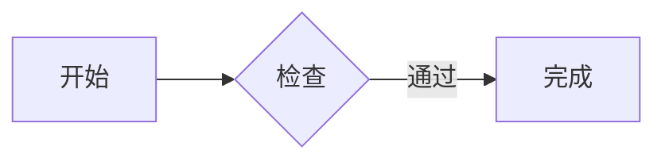
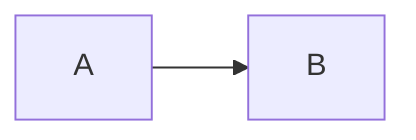

# Mermaid blocks

```mermaid
flowchart LR
  A[开始] --> B{检查}
  B -->|通过| C[完成]
```

```mermaid
flowchart LR
  broken[missing close
```

```mermaid
flowchart LR
  A --> B
  click B "javascript:alert('blocked')" "unsafe link"
```
